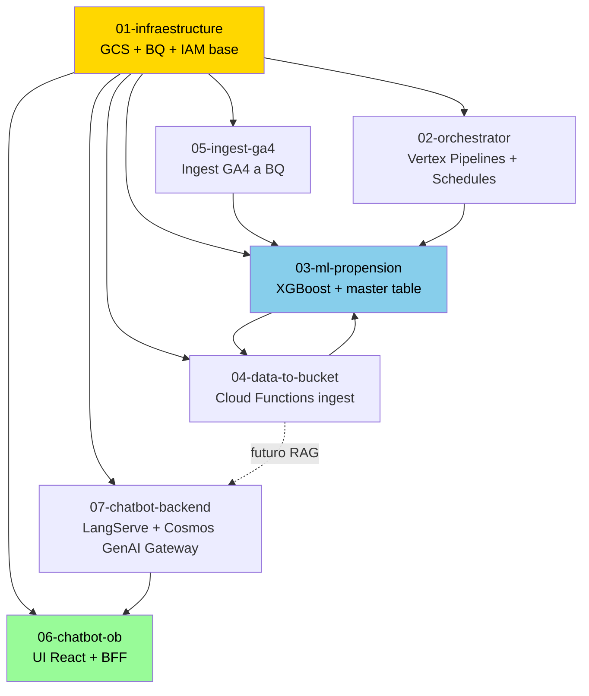

# Booster Playbooks LATAM

Serie de playbooks tecnicos que documentan el hands-on de [Propension](./01-glossary.md#propension) de Compra de Tickets del onboarding [LATAM](./01-glossary.md#latam) [Cosmos](./01-glossary.md#cosmos). Un `.md` por repo, en orden cronologico end-to-end.

No es documentacion oficial LATAM. Es lo que YO viví armando este hands-on entre julio y agosto 2026. Va derecho al hueso: comandos que corri, errores que me tire, cómo los resolvi.

---

## Indice

- [Estructura](#estructura)
- [Mapa de dependencias entre repos](#mapa-de-dependencias-entre-repos)
- [Orden de lectura recomendado](#orden-de-lectura-recomendado)
- [Convenciones globales](#convenciones-globales)
- [Como usar esta serie](#como-usar-esta-serie)
- [Convenciones de los .md](#convenciones-de-los-md)
- [Convencion de hipertexto](#convencion-de-hipertexto)
- [Validacion](#validacion)

---

## Estructura

```
latam-booster-playbooks/
├── 00-README.md               <-- estas aca
├── 01-glossary.md             glosario de terminos LATAM
├── 02-prerequisitos-globales.md   setup comun (GitLab, gcloud, Python)
├── assets/
│   ├── dataform/              .sqlx sanitizados de master tables
│   ├── terraform/             snippets de modulos TF reutilizables
│   └── ci/                    fragmentos de .gitlab-ci.yml
├── scripts/
│   └── validate.sh            validador estructural de .md
└── repos/
    ├── 01-infraestructure.md
    ├── 02-orchestrator.md
    ├── 03-ml-propension.md
    ├── 04-data-to-bucket.md
    ├── 05-ingest-ga4.md
    └── 06-chatbot-ob.md
```

---

## Actividad real en `develop` (al 31-jul-2026)

Snapshot de commits y MRs mergeados a `develop` por repo, extraído vía GitLab API:

| # | Repo | Commits | MRs | Archivos totales | Archivos tocados | % tocado | Rango |
|---|---|---:|---:|---:|---:|---:|---|
| 01 | [infraestructure](./repos/01-infraestructure.md) | 23 | 9 | 19 | 19 | 100% | 13-jul → 29-jul |
| 02 | [orchestrator](./repos/02-orchestrator.md) | 1 | 0 | 31 | 20 | 65% | 15-jul → 15-jul |
| 03 | [ml-propension](./repos/03-ml-propension.md) | 34 | 8 | 60 | 38 | 63% | 16-jul → 30-jul |
| 04 | [data-to-bucket](./repos/04-data-to-bucket.md) | 7 | 3 | ~14 | 5 | 65% | 22-jul → 23-jul |
| 05 | [ingest-ga4](./repos/05-ingest-ga4.md) | 5 | 2 | ~5 | 5 | 65% | 17-jul → 20-jul |
| 06 | [chatbot-ob](./repos/06-chatbot-ob.md) | 1 | 0 | 81 | 5 | N/A | 23-jul → 23-jul |
| 07 | [chatbot-backend](./repos/07-chatbot-backend.md) | 1 | 0 | 31 | 0 | N/A | 23-jul → 23-jul |
| **Totales** | | **75** | **22** | **292** | **141** | **48%** | 13-jul → 30-jul |

Observaciones:

- `infraestructure` y `ml-propension` concentran el **77%** de commits y MRs.
- `orchestrator`, `chatbot-ob` y `chatbot-backend` tienen 1 commit / 0 MRs: scaffolds Copier con ajuste mínimo.
- Hands-on completo en **18 días calendario** (13-jul → 30-jul-2026).

---


## Mapa de dependencias entre repos



Lectura del grafo:
- Amarillo: base (todo depende de infraestructure).
- Celeste: nucleo (ML es el corazon del hands-on).
- Verde: capa de aplicacion (chatbot que consume el modelo).

---

## Orden de lectura recomendado

| # | Playbook | Duracion | Prerequisitos |
|---|---|---|---|
| 0 | [`01-glossary.md`](./01-glossary.md) | 15 min | ninguno |
| 0 | [`02-prerequisitos-globales.md`](./02-prerequisitos-globales.md) | 30 min | ninguno |
| 1 | [`repos/01-infraestructure.md`](./repos/01-infraestructure.md) | 2h | prereqs OK |
| 2 | [`repos/02-orchestrator.md`](./repos/02-orchestrator.md) | 1.5h | 01 aplicado |
| 3 | [`repos/03-ml-propension.md`](./repos/03-ml-propension.md) | 3h | 01, 02, 04, 05 aplicados |
| 4 | [`repos/04-data-to-bucket.md`](./repos/04-data-to-bucket.md) | 1.5h | 01 aplicado |
| 5 | [`repos/05-ingest-ga4.md`](./repos/05-ingest-ga4.md) | 1.5h | 01 aplicado |
| 6 | [`repos/06-chatbot-ob.md`](./repos/06-chatbot-ob.md) | 2h | 03 con modelo servido |

---

## Convenciones globales

Todos los playbooks respetan estas convenciones:

- **Namespace repos**: `nelsonacosta-ob-<nombre>` (reemplazar por tu username-ob). Ver [glosario > Namespace ob](./01-glossary.md#namespace-ob).
- **Region GCP**: siempre `us-east1`.
- **Branch de trabajo**: siempre `develop` (no `main`, no `master`).
- **Terraform apply**: solo desde CI en `develop` post-merge. Branches solo hacen `plan`. Ver [glosario > Terraform apply policy](./01-glossary.md#terraform-apply-policy).
- **Aprobacion MR**: reviewer aprueba, autor mergea (nunca al reves).
- **Email de commits**: `@latam.com` (no `@globant.com`).

---

## Como usar esta serie

1. Leer [`01-glossary.md`](./01-glossary.md) y [`02-prerequisitos-globales.md`](./02-prerequisitos-globales.md).
2. Ejecutar el checklist de prereqs. Si algo falla, resolver antes de seguir.
3. Trabajar los repos en orden numerico. Cada uno tiene su `depends_on` verificable.
4. Al terminar un repo, correr el "Checklist de terminé bien" del final del .md.
5. Si me tiro un pitfall nuevo (no documentado), agregarlo al .md correspondiente con fecha.

---

## Convenciones de los .md

Cada [`repos/0X-*.md`](./repos/) tiene la misma estructura:

1. Frontmatter YAML con metadata del repo.
2. Que hace este repo (proposito).
3. Diagrama de contexto (donde encaja).
4. Prerequisitos verificables (comandos).
5. Estructura del repo (arbol).
6. Diagrama de flujo del pipeline CI/CD.
7. Pasos ordenados (con comandos + output esperado).
8. Pitfalls con fecha real.
9. Arbol de decision (sintoma → pitfall N).
10. Checklist de "termine bien".
11. Referencias.

---

## Convencion de hipertexto

Estos `.md` son un grafo navegable. Los links siguen esta jerarquia:

| Tipo de referencia | Formato |
|---|---|
| Termino del glosario | `[Cosmos](./01-glossary.md#cosmos)` |
| Otro playbook | `[02-orchestrator](./repos/02-orchestrator.md)` |
| Seccion interna del mismo .md | `[ver Pitfall O3](#pitfall-o3---bom-en-schemayaml)` |
| Archivo `.sqlx` propio del repo playbooks | `[master_propension.sqlx](./assets/dataform/master_propension.sqlx)` |
| Archivo autoritativo en GitLab LATAM | link completo `https://gitlab.com/latamairlines/data/data-ai-ops/data-ops/shared-services/cross/nelsonacosta-ob/<repo>/-/blob/develop/<path>` |
| Sesion / commit / MR | referenciar por fecha inline si no hay link publico |

Todos los `.sqlx` complejos viven en [`assets/dataform/`](./assets/dataform/) sanitizados (sin nombres de tablas privadas), con link a la version autoritativa en GitLab arriba del archivo.

---

## Validacion

Antes de commitear un cambio, correr:

```bash
bash scripts/validate.sh repos/0X-<nombre>.md
```

Devuelve OK si:
- Frontmatter YAML valido.
- 3 diagramas Mermaid.
- 9 secciones canonicas.
- 0 refs prohibidas (tokens, keys, emails privados).
