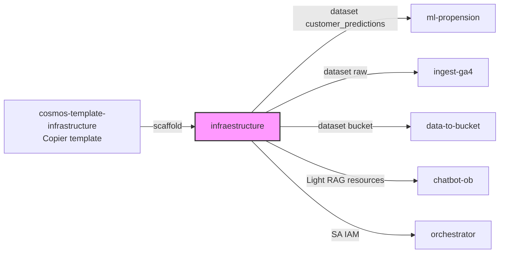
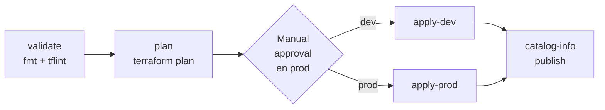
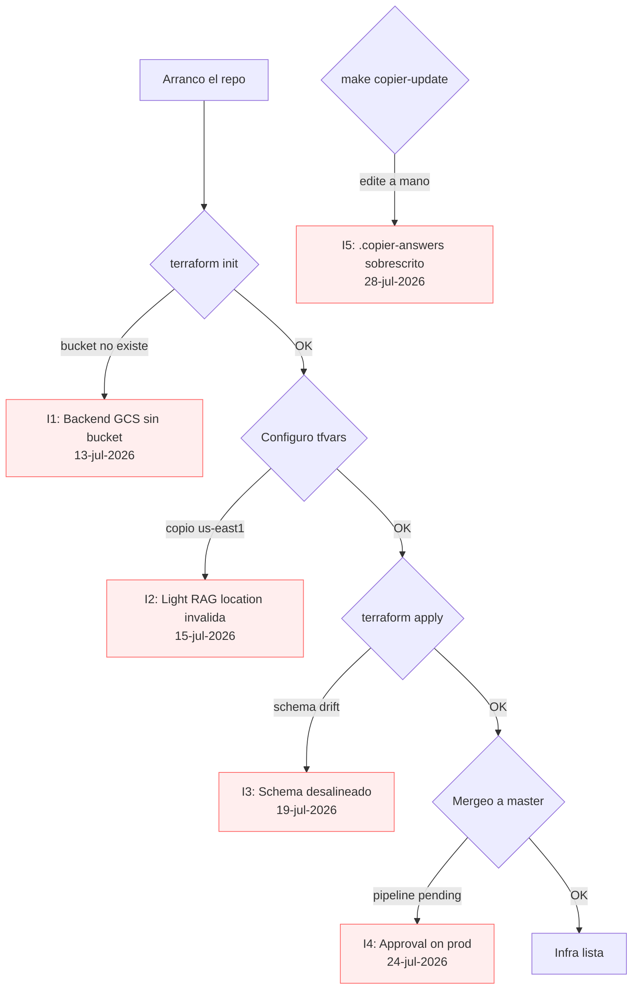

# 01. infraestructure — Base Terraform del data product

> Primer repo del hands-on. Provisiona la infra GCP compartida (dataset BigQuery, IAM, Light RAG) que todos los demás repos consumen.

## Índice

- [Qué es este repo](#qué-es-este-repo)
- [Actividad en develop](#actividad-en-develop)
- [Prerequisitos](#prerequisitos)
- [Estructura del repo](#estructura-del-repo)
- [Flujo end-to-end](#flujo-end-to-end)
- [Pitfalls vividos](#pitfalls-vividos)
- [Datos y ejecución operativa](#datos-y-ejecución-operativa)
- [Checklist de entrega](#checklist-de-entrega)
- [Referencias](#referencias)

## Qué es este repo

Es el **primer repo** del namespace [nelsonacosta-ob](../01-glossary.md#namespace-ob) y el que todos los demás importan como dependencia lógica. Provisiona:

- Un [BigQuery](../01-glossary.md#bigquery) dataset (`nelsonacosta_ob_propension_data`) y una tabla (`customer_predictions`) donde el modelo ML deposita las predicciones diarias.
- IAM de service accounts (el resto de repos consumen esos SAs).
- Recursos de [Light RAG](../01-glossary.md#light-rag) — componente GenAI del step 3 del handson.

Se genera con [Copier](../01-glossary.md#copier) a partir del template `cosmos-template-infrastructure` ([ver .copier-answers.yaml](#estructura-del-repo)).

### Diagrama: rol en el ecosistema



## Actividad en develop

Snapshot al 2026-07-31 (rama `develop`):

| Métrica | Valor |
|---|---|
| Commits totales | 23 |
| Merge Requests mergeados | 9 |
| Archivos totales en repo | 19 |
| Archivos tocados en el historial | 19 (100%) |
| Rango de fechas | 2026-07-13 → 2026-07-29 |
| Reviewer principal | <REVIEWER_NEURALWORKS> |
| Intensidad | **Alta** — toqué el 100% del repo, típico del primero |

Fue **el repo más peleado en Terraform**: acá aprendí Cosmos y me choqué con los [pitfalls](#pitfalls-vividos) de state, IAM y Light RAG location.

## Prerequisitos

Ver [02-prerequisitos-globales](../02-prerequisitos-globales.md) para el setup común. Específico de este repo:

- Cuenta LATAM `<TU_EMAIL_EXT>@latam.com` con acceso a los proyectos GCP:
  - `ss-data-dev` (project id del env dev)
  - `ss-data-prod` (project id del env prod)
- Bucket GCS de Terraform state ya creado por CI (`terraform-state-nelsonacosta-ob-infraestructure`).
- Terraform ≥ 1.5.5 instalado local (ver `config.tf` línea 2).

## Estructura del repo

```
nelsonacosta-ob-infraestructure/
├── .copier-answers.yaml       # Referencia al template Copier (NO editar)
├── .gitlab-ci.yml             # Incluye pipeline base de Cosmos (5 lineas)
├── .version                   # Semver del componente
├── Makefile                   # target `copier-update` para regenerar scaffold
├── README.md                  # Solo apunta a docs/
├── catalog-info.yaml          # Backstage: registro del componente + System
├── config.tf                  # Provider google + backend GCS
├── config/                    # (vacio, .gitkeep)
├── data-product-docs/         # MkDocs para el System (nivel producto)
├── docs/                      # MkDocs para el Component (nivel repo)
├── main.tf                    # 197 lineas — dataset + tabla + Light RAG
├── mkdocs.yml
├── rc.json                    # Auto-RC para tickets de cambio LATAM
├── terraform.tfvars           # Valores concretos del componente
└── variables.tf               # Declaracion de variables
```

Archivo autoritativo en GitLab: [nelsonacosta-ob-infraestructure](https://gitlab.com/latamairlines/data/shared-services/cross/nelsonacosta-ob/nelsonacosta-ob-infraestructure/-/tree/develop).

## Flujo end-to-end

### 1. Bootstrap con Copier

El scaffold lo generó el proceso oficial LATAM (ver [nelson-latam-onboarding-flow](../01-glossary.md#booster-onboarding)). Se materializa con:

```powershell
# Desde la Dell LATAM, en un directorio limpio
copier copy git@gitlab.com:latamairlines/data/data-ai-ops/cosmos/cosmos-template/cosmos-template-infrastructure.git nelsonacosta-ob-infraestructure
```

El template quedó fijado en [.copier-answers.yaml](https://gitlab.com/latamairlines/data/shared-services/cross/nelsonacosta-ob/nelsonacosta-ob-infraestructure/-/blob/develop/.copier-answers.yaml):

```yaml
_commit: v3.5.1
_src_path: git@gitlab.com:latamairlines/data/data-ai-ops/cosmos/cosmos-template/cosmos-template-infrastructure.git
component_name: nelsonacosta-ob-infraestructure
product_name: nelsonacosta-ob
team: ai-sharedservices
domains:
  dev:  ss-data-dev
  prod: ss-data-prod
```

Para actualizar el scaffold cuando el template cambia:

```bash
make copier-update           # ultima version
make copier-update REF=v3.6  # version pinneada
```

### 2. Backend GCS (config.tf)

```hcl
terraform {
  required_version = ">= 1.5.5"
  backend "gcs" {
    prefix = "nelsonacosta-ob-infraestructure/state"
  }
}
```

El bucket lo inyecta el CI base ([ver Pitfall I1](#pitfall-i1)) — no está hardcodeado en el repo.

### 3. Variables y valores

Variables declaradas en `variables.tf` (66 líneas). Los valores concretos en [terraform.tfvars](https://gitlab.com/latamairlines/data/shared-services/cross/nelsonacosta-ob/nelsonacosta-ob-infraestructure/-/blob/develop/terraform.tfvars):

```hcl
project_ids = {
  dev  = "ss-data-dev",
  prod = "ss-data-prod"
}
gcp_region   = "us-east1"
team         = "ai-sharedservices"
product_name = "nelsonacosta-ob"

dataset_id          = "nelsonacosta_ob_propension_data"
dataset_description = "Dataset for customer propension analysis"
table_id            = "customer_predictions"
schema = [
  { name = "CUSTOMER_ID",       type = "STRING",    mode = "REQUIRED" },
  { name = "snapshot_date",     type = "DATE",      mode = "REQUIRED" },
  { name = "PROPENSITY",        type = "FLOAT64",   mode = "NULLABLE" },
  { name = "PROPENSITY_BUCKET", type = "STRING",    mode = "NULLABLE" },
  { name = "prediction_dt",     type = "TIMESTAMP", mode = "NULLABLE" },
]

light_rag_location = "us"   # global | us | eu — NO us-east1 (Pitfall I2)
genai_gateway_url  = "https://genai.cosmos.dev.appslatam.com"
```

El schema está alineado 1:1 con el output de `serving_pipeline.py::postprocessing_serving` en [ml-propension](./03-ml-propension.md).

### 4. Provider y workspace multi-env

`config.tf` usa `terraform.workspace` para elegir el project id:

```hcl
provider "google" {
  project = lookup(var.project_ids, terraform.workspace)
  region  = "us-east1"
  default_labels = {
    environment  = terraform.workspace
    product_name = var.product_name
    team         = var.team
  }
}
```

Workflow local (nunca ejecutar `apply` a mano — [ver Terraform apply policy](../01-glossary.md#terraform-apply-policy)):

```bash
terraform init
terraform workspace select dev   # o crear: terraform workspace new dev
terraform plan                    # solo para review
```

### 5. Pipeline GitLab (.gitlab-ci.yml)

El pipeline es **5 líneas** — todo el trabajo lo hace el template base de Cosmos:

```yaml
include:
  - project: "latamairlines/data/data-ai-ops/cosmos/cicd-pipelines/base-pipelines"
    file: 'templates/terraform-pipeline.yml'
    inputs:
      approval_on_prod: "True"
```

Stages que ejecuta:



### 6. Backstage catalog

`catalog-info.yaml` registra **dos entidades**:

- Un `Component` (`nelsonacosta-ob-infraestructure`) — el repo.
- Un `System` (`nelsonacosta-ob`) — el data product entero.

Esto es lo que hace que el data product aparezca en [Backstage](../01-glossary.md#backstage) LATAM.

## Pitfalls vividos

### Árbol de pitfalls por fase



<a id="pitfall-i1"></a>
### Pitfall I1 — Backend GCS sin bucket (13-jul-2026)

**Síntoma:** `terraform init` falla con `failed to load state: bucket not found`.

**Causa:** El bucket de state (`terraform-state-nelsonacosta-ob-infraestructure`) lo crea el pipeline base **la primera vez que corre en dev**. Si intentás correr `terraform init` local antes del primer pipeline, no existe.

**Solución:** No corras `init` local antes del primer pipeline. Si querés forzar, creá el bucket a mano:

```bash
gsutil mb -p ss-data-dev -l us-east1 gs://terraform-state-nelsonacosta-ob-infraestructure
```

<a id="pitfall-i2"></a>
### Pitfall I2 — Light RAG location inválida (15-jul-2026)

**Síntoma:** `apply` falla con `Invalid location: us-east1. Must be one of: global, us, eu`.

**Causa:** Copié `us-east1` (que es la región de todo lo demás) para `light_rag_location`. Light RAG solo acepta las 3 macro-locations.

**Solución:** En `terraform.tfvars`:

```hcl
light_rag_location = "us"   # NO us-east1
```

Documentado en el comentario del propio archivo.

<a id="pitfall-i3"></a>
### Pitfall I3 — Schema desalineado con serving_pipeline.py (19-jul-2026)

**Síntoma:** `ml-propension` corre serving OK pero el `WRITE_APPEND` a BigQuery falla con `field mismatch`.

**Causa:** Toqué el schema en `terraform.tfvars` sin sincronizar con el output real de [postprocessing_serving](./03-ml-propension.md#serving-pipeline).

**Solución:** El schema **canónico** vive en `variables.tf` (líneas 44-50). Si necesitás cambiarlo:

1. Editá **primero** `postprocessing_serving` en ml-propension.
2. Actualizá `variables.tf` y `terraform.tfvars` acá.
3. Corré `terraform apply` **antes** del próximo pipeline de ml-propension.

<a id="pitfall-i4"></a>
### Pitfall I4 — Approval on prod bloquea el MR (24-jul-2026)

**Síntoma:** Mergeo a `master` y el pipeline queda "pending manual action" en `apply-prod`.

**Causa:** `approval_on_prod: "True"` en `.gitlab-ci.yml` es **intencional**. Es la puerta de aprobación de LATAM.

**Solución:** No es un bug, es política. Necesitás que un Staff LATAM (Diego/Rudy) apruebe manualmente el job `apply-prod` en GitLab UI. Antes de mergear, avisar por Slack — [nelson-latam-staff-communication](../01-glossary.md#staff-latam).

<a id="pitfall-i5"></a>
### Pitfall I5 — Editar .copier-answers.yaml a mano (28-jul-2026)

**Síntoma:** El próximo `make copier-update` sobrescribe mis cambios.

**Causa:** El archivo dice literalmente en la línea 1: `Changes here will be overwritten by Copier; NEVER EDIT MANUALLY`.

**Solución:** Nunca editar `.copier-answers.yaml`. Si necesitás cambiar algo del scaffold:

- Cambios chicos → editar los `.tf` directamente.
- Cambios grandes → PR al template `cosmos-template-infrastructure` (que ya no tengo permiso, así que → Staff LATAM).

## Datos y ejecución operativa

### Artefactos SQL/Dataform en este repo

Ninguno. Este repo es 100% Terraform. Crea infra base (bucket de state, service accounts, workflows configs, secrets) sobre la que después corren orchestrator, ml-propension y data-to-bucket.

### Comandos operativos desde la Dell (PowerShell)

Autenticación GCP:

```powershell
gcloud auth login
gcloud auth application-default login
gcloud config set project latam-hands-on-nelsonacosta-ob
gcloud config set account [REDACTED]
```

Ciclo Terraform desde el root del repo (rama `develop`):

```powershell
cd C:\latam\nelsonacosta-ob-infraestructure
git checkout develop
git pull

terraform init -backend-config="bucket=tf-state-nelsonacosta-ob"
terraform validate
terraform plan -out=tfplan.out
terraform apply tfplan.out
```

Verificación del state remoto en GCS:

```powershell
gsutil ls gs://tf-state-nelsonacosta-ob/
gsutil cat gs://tf-state-nelsonacosta-ob/default.tfstate | jq '.resources[] | .type' | sort -u
```

### Queries de verificación (bq CLI)

Comprobar que los datasets base fueron creados por Terraform:

```powershell
bq ls --project_id=latam-hands-on-nelsonacosta-ob
bq show --format=prettyjson latam-hands-on-nelsonacosta-ob:nelsonacosta_ob_dev
```

### Rollback / re-ejecución

Re-correr solo un módulo sin tocar el resto:

```powershell
terraform apply -target=module.dataform_repo -auto-approve
```

Destruir todo (solo en sandbox propio, nunca en shared):

```powershell
terraform destroy -auto-approve
```

Ver el diff antes de aplicar sin usar `plan`:

```powershell
terraform show -json tfplan.out | jq '.resource_changes[] | select(.change.actions[] != "no-op")'
```

### Assets sanitizados en este repo de playbooks

Ninguno. Este playbook no tiene contraparte en `../assets/dataform/`. Ver [`../assets/terraform/`](../assets/terraform/) si en el futuro se copian módulos sanitizados.

## Checklist de entrega

Antes de mergear a `master`:

- [ ] `terraform fmt -recursive` (el CI lo valida).
- [ ] `terraform validate` con workspace `dev`.
- [ ] Pipeline `develop` verde (validate + plan).
- [ ] MR aprobado por reviewer (<REVIEWER_NEURALWORKS>).
- [ ] Backstage recognizes el componente (revisar en catalog UI).
- [ ] Dataset `nelsonacosta_ob_propension_data` visible en `bq ls ss-data-dev:`.
- [ ] Tabla `customer_predictions` con schema idéntico al de `serving_pipeline.py`.

Comandos de verificación post-apply:

```bash
# Dataset creado
bq --project_id=ss-data-dev ls nelsonacosta_ob_propension_data

# Schema de la tabla
bq --project_id=ss-data-dev show --schema --format=prettyjson \
  nelsonacosta_ob_propension_data.customer_predictions

# Light RAG resources
gcloud beta discovery-engine data-stores list --location=us --project=ss-data-dev
```

## Referencias

- [Repo GitLab](https://gitlab.com/latamairlines/data/shared-services/cross/nelsonacosta-ob/nelsonacosta-ob-infraestructure) — fuente autoritativa
- [main.tf](https://gitlab.com/latamairlines/data/shared-services/cross/nelsonacosta-ob/nelsonacosta-ob-infraestructure/-/blob/develop/main.tf) — recursos Terraform
- [variables.tf](https://gitlab.com/latamairlines/data/shared-services/cross/nelsonacosta-ob/nelsonacosta-ob-infraestructure/-/blob/develop/variables.tf) — schema canónico
- [cosmos-template-infrastructure](https://gitlab.com/latamairlines/data/data-ai-ops/cosmos/cosmos-template/cosmos-template-infrastructure) — template Copier fuente
- [Backstage LATAM](../01-glossary.md#backstage) — catálogo de componentes
- Siguiente en el flujo: [02-orchestrator](./02-orchestrator.md)
