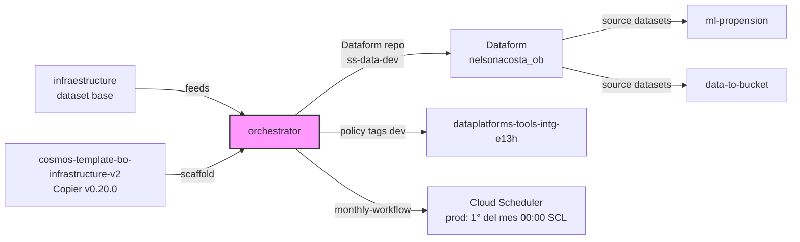
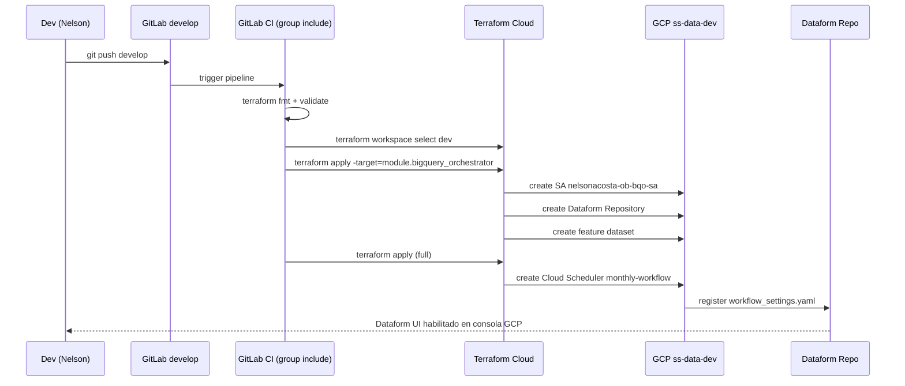
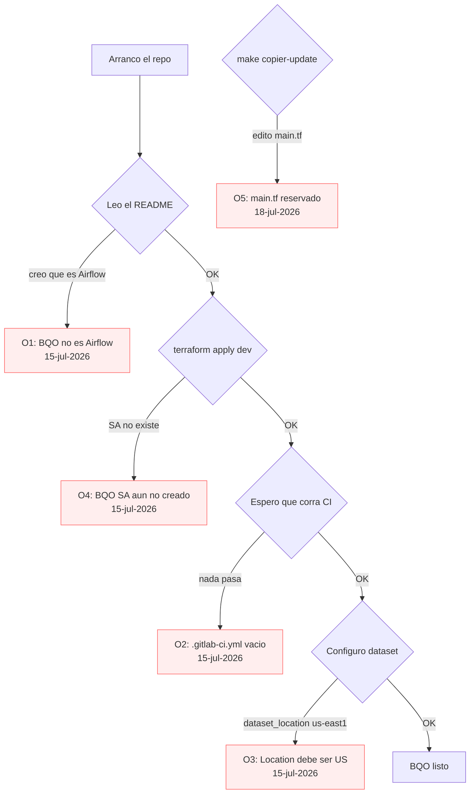

# 02. orchestrator — BigQuery Orchestrator (BQO)

> Segundo repo del hands-on. Es el **motor Dataform** que orquesta todas las transformaciones SQL sobre BigQuery. Scaffold puro: 1 commit, 0 MRs — pero critico entenderlo antes de tocar `ml-propension` o `data-to-bucket`.

## Índice

- [Qué es este repo](#qué-es-este-repo)
- [Actividad en develop](#actividad-en-develop)
- [Prerequisitos](#prerequisitos)
- [Estructura del repo](#estructura-del-repo)
- [Flujo end-to-end](#flujo-end-to-end)
- [Pitfalls vividos](#pitfalls-vividos)
- [Datos y ejecución operativa](#datos-y-ejecución-operativa)
- [Checklist de entrega](#checklist-de-entrega)
- [Referencias](#referencias)

## Qué es este repo

Es el [BigQuery Orchestrator](../01-glossary.md#bigquery-orchestrator) (BQO) del data product `nelsonacosta-ob`. En criollo: es un **repo Dataform + Terraform** que:

- Provisiona una **Dataform repository** dentro de GCP (via módulo `terraform-modules-bigquery-orchestrator`).
- Define workflows programados (`monthly-workflow` en `custom_infrastructure.tf`).
- Aplica **policy tags** de LATAM (customer PII, banking, financial, etc.) sobre las columnas sensibles.
- Sirve como **repo padre** de Dataform: los repos `ml-propension` y `data-to-bucket` referencian los datasets y schemas que se crean acá.

El detalle "raro" es que **no orquesta pipelines Vertex ni Airflow** — el nombre `orchestrator` es 100% Dataform. Si te confundís con esto, tenés el [Pitfall O1](#pitfall-o1).

### Diagrama: rol en el ecosistema



## Actividad en develop

Snapshot al 2026-07-31 (rama `develop`):

| Métrica | Valor |
|---|---|
| Commits totales | 1 |
| Merge Requests mergeados | 0 |
| Archivos totales en repo | 31 |
| Archivos tocados en el historial | 20 (65%) |
| Rango de fechas | 2026-07-15 → 2026-07-15 |
| Reviewer principal | — (no hubo MRs) |
| Intensidad | **Baja** — scaffold puro Copier con ajuste mínimo |

Es el **repo más "boring"** del hands-on: casi todo lo hace el template `cosmos-template-bo-infrastructure-v2`. Vos solo confirmás que el scaffold quedó bien y hacés push a `develop`. Los 20 archivos tocados son los que Copier renderiza con valores del producto (nombre, dataset, project ids, policy tags, etc.).

Es una **buena señal** que este repo tenga tan poca actividad: significa que el template hace su trabajo. Si tenés que meter muchos commits acá, probablemente estás peleando contra Cosmos ([ver Pitfall O2](#pitfall-o2)).

## Prerequisitos

Ver [02-prerequisitos-globales](../02-prerequisitos-globales.md). Específico de este repo:

- [infraestructure](./01-infraestructure.md) debe estar **applied en dev** — el dataset `nelsonacosta_ob_propension_data` tiene que existir en `ss-data-dev`.
- Acceso al proyecto `dataplatforms-tools-intg-e13h` (policy tags dev). LATAM te lo da al onboarding.
- Dataform Core 3.0.0 conocido (no `apt install` — se resuelve en el pipeline).

## Estructura del repo

```
nelsonacosta-ob-orchestrator/
├── .copier-answers.yml (en config/)  # Referencia al template Copier
├── .gitlab-ci.yml                    # VACIO (Pitfall O2)
├── CLAUDE.md                         # Instrucciones plugin cosmos-studio para Claude Code
├── README.md
├── catalog-info.yaml                 # Backstage: Component + system bigquery-orchestrator
├── workflow_settings.yaml            # Config global Dataform (project, dataset, vars)
├── rc.json                           # Auto-RC LATAM
├── includes/
│   ├── constants.js                  # (comentado; ejemplo de vars globales)
│   ├── get_policy_tags.js            # Selector dev/prod de policy tags (NO MODIFICAR)
│   └── policy_tags/
│       ├── dev_policy_tags.js        # 17 taxonomies dev (ado, customer, banking, ...)
│       └── prod_policy_tags.js       # 17 taxonomies prod
├── definitions/                      # Modelos SQLX de Dataform (mayoritariamente .keep)
│   ├── models/    (.keep)
│   ├── sources/   (.keep)
│   ├── tests/     (.keep)
│   ├── work/      (.keep)
│   └── raw/       (.keep)
├── terraform/
│   ├── config.tf                     # Provider + backend GCS
│   ├── main.tf                       # Módulo bigquery_orchestrator (NO EDITAR)
│   ├── custom_infrastructure.tf      # Aquí SI se define tu infra custom (workflows)
│   ├── variables.tf
│   ├── terraform.tfvars              # project_ids, cd_sa_email, dataset name
│   └── locals.tf
├── docs/                             # MkDocs Component
├── data-product-docs/                # MkDocs System
└── catalog/                          # (vacio)
```

Archivo autoritativo en GitLab: [nelsonacosta-ob-orchestrator](https://gitlab.com/latamairlines/data/shared-services/cross/nelsonacosta-ob/nelsonacosta-ob-orchestrator/-/tree/develop).

Nota: `terraform/main.tf` empieza con un comentario **rojo**:

```
#---------------------------- PLEASE DO NOT ADD ANY ADDITIONAL INFRASTRUCTURE TO THIS FILE ----------------------------#
# If you need to define new infrastructure, use the custom_infrastructure.tf file instead.                             #
```

Respetar. Toda infra adicional (schedulers, extras) va en `custom_infrastructure.tf`.

## Flujo end-to-end

### 1. Scaffold con Copier

Igual que en [01-infraestructure](./01-infraestructure.md), pero con otro template:

```powershell
copier copy git@gitlab.com:latamairlines/data/data-ai-ops/cosmos/cosmos-template/cosmos-template-bo-infrastructure-v2.git nelsonacosta-ob-orchestrator
```

`.copier-answers.yml` fijado en `v0.20.0`. Valores relevantes:

```yaml
_commit: v0.20.0
component_name: nelsonacosta-ob-orchestrator
product_name: nelsonacosta-ob
product_path: shared-services/cross/nelsonacosta-ob
dataset_location: US            # NO us-east1 (es Dataform, ver Pitfall O3)
dataform_core_version: 3.0.0
domains:
    dev: ss-data-dev
    prod: ss-data-prod
project_policy_tag:
    dev: dataplatforms-tools-intg-e13h
    prod: dataplatforms-tools-prod-79e1
use_cmdb: true
cmdb_key: cmdb-nelsonacosta-ob
cmdb_value: nelsonacosta-ob
rc_mode: automatic              # el CI genera el RC automaticamente
```

### 2. workflow_settings.yaml (config Dataform)

Es el archivo raíz que Dataform Core lee. Define **dónde** corre todo:

```yaml
defaultProject: "ss-data-dev"
defaultLocation: "US"
defaultDataset: "nelsonacosta_ob"
defaultAssertionDataset: "nelsonacosta_ob"
dataformCoreVersion: "3.0.0"
vars:
    component_service_account: "nelsonacosta-ob-bqo-sa@ss-data-dev.iam.gserviceaccount.com"
    project_id: "ss-data-dev"
    environment: "dev"
    use_prod_policy_tags: "false"
    policy_tag_dev: "dataplatforms-tools-intg-e13h"
    policy_tag_prod: "dataplatforms-tools-prod-79e1"
```

Los `vars` son accesibles desde los `.sqlx` como `${dataform.projectConfig.vars.environment}`.

### 3. Terraform: módulo bigquery_orchestrator

`terraform/main.tf` es **solo un module call**:

```hcl
module "bigquery_orchestrator" {
  source          = "gitlab.com/latamairlines/terraform-modules-bigquery-orchestrator/cosmos"
  version         = "~>0"
  cd_sa_email     = var.cd_sa_email[terraform.workspace]
  product_name    = var.product_name
  vcs_path        = var.vcs_path
  project_id      = var.project_ids[terraform.workspace]
  team            = var.team
  dataset_location = var.dataset_location

  dataset = {
    name        = var.dataset.name,
    description = var.dataset.description
  }
}
```

Ese módulo (fuente cerrada, vive en el registry interno LATAM) crea:

- Un **Dataform Repository** en `ss-data-dev` con el nombre del producto.
- El **service account** `nelsonacosta-ob-bqo-sa@ss-data-dev.iam.gserviceaccount.com`.
- El **feature dataset** (`create_feature_dataset = true` por default).
- Vincula el repo al VCS (GitLab) via `vcs_path`.

### 4. Terraform: workflows custom

`custom_infrastructure.tf` define el scheduler. Ejemplo del template:

```hcl
module "dataform_workflow_monthly" {
  source                   = "gitlab.com/latamairlines/terraform-modules-dataform-workflow-config/cosmos"
  version                  = "~>0"
  project_id               = lookup(var.project_ids, terraform.workspace)
  region                   = var.gcp_region
  dataform_repository_name = module.bigquery_orchestrator.dataform_instance_name
  workflow_config_name     = "monthly-workflow"

  # No auto-run en DEV — solo prod corre programado.
  cron_schedule = terraform.workspace == "prod" ? "0 0 1 * *" : ""
  time_zone     = "America/Santiago"

  invocation_config = {
    transitive_dependencies_included         = true
    transitive_dependents_included           = true
    fully_refresh_incremental_tables_enabled = false
    service_account                          = module.bigquery_orchestrator.product_sa_email
  }
}
```

Puntos importantes:

- **Prod corre 1° del mes a las 00:00 SCL** (`"0 0 1 * *"`, `time_zone = "America/Santiago"`).
- **Dev no corre programado** (cron vacío). Se ejecuta on-demand desde consola o Dataform UI.
- `transitive_dependencies_included = true`: el workflow arrastra todas las dependencias — ojo con `ml-propension` cuando defina sus `sqlx`.

### 5. Policy tags LATAM

`includes/get_policy_tags.js` es la función selectora dev/prod (**NO MODIFICAR** — dice el comentario en la línea 1):

```javascript
function getPolicyTags(){
    if (dataform.projectConfig.vars.use_prod_policy_tags === "true"){
        return policy_tags_prod;
    } else {
        return dataform.projectConfig.vars.environment === "dev"
            ? policy_tags_dev
            : policy_tags_prod;
    }
}
```

`dev_policy_tags.js` mapea 17 taxonomies:

```
ado, agent, banking_information, cargo, crew, customer, employee,
exploratory, ffp, financial, flight, legal, mantto, provider,
safety, technology, test
```

En los `.sqlx` se usan así:

```sql
config {
  type: "table",
  columns: {
    customer_id: {
      description: "Customer identifier",
      bigqueryPolicyTags: [ ${policy_tags.customer.customer_id} ]
    }
  }
}
```

### 6. Pipeline GitLab

`.gitlab-ci.yml` está **vacío**. Es intencional: el pipeline lo aplica el flujo LATAM directamente. Ver [Pitfall O2](#pitfall-o2).

### 7. Backstage catalog

```yaml
metadata:
  name: nelsonacosta-ob
spec:
  type: service
  system: bigquery-orchestrator
  dependsOn:
    - component:default/bigquery-orchestrator-infrastructure
```

Importante: **este componente aparece en Backstage bajo el system `bigquery-orchestrator`**, no bajo `nelsonacosta-ob`. Es intencional: LATAM tiene un system central de BQO al que se suscriben todos los data products.

### Diagrama: pipeline de deploy end-to-end



## Pitfalls vividos

### Árbol de pitfalls por fase



<a id="pitfall-o1"></a>
### Pitfall O1 — "Orchestrator" no es Airflow ni Vertex (15-jul-2026)

**Síntoma:** Abro el repo esperando ver DAGs Python, Cloud Composer, o pipelines Vertex. No encuentro ni uno.

**Causa:** `orchestrator` en LATAM Cosmos significa **BigQuery Orchestrator (BQO)** — es un envoltorio de Dataform, no un scheduler tipo Airflow. Es el motor SQL de transformaciones, no el orquestador de pipelines ML.

**Solución:** Ajustá el modelo mental. El "scheduler de pipelines" en LATAM es **Vertex AI Pipelines** ([ver ml-propension](./03-ml-propension.md#serving-pipeline)). El BQO orquesta **SQL** (dataset→dataset), no ML.

<a id="pitfall-o2"></a>
### Pitfall O2 — `.gitlab-ci.yml` vacío (15-jul-2026)

**Síntoma:** Hago push a `develop` y no arranca ningún pipeline. Comparo con `infraestructure` que tiene 5 líneas de `include:` y funciona.

**Causa:** El template `cosmos-template-bo-infrastructure-v2` deja el `.gitlab-ci.yml` **intencionalmente vacío** en `v0.20.0`. El pipeline se aplica via un include que LATAM inyecta a nivel de grupo GitLab, no del repo.

**Solución:** No es un bug. Si querés forzar CI custom, agregá tu `include:` como en `infraestructure`:

```yaml
include:
  - project: "latamairlines/data/data-ai-ops/cosmos/cicd-pipelines/base-pipelines"
    file: 'templates/dataform-pipeline.yml'
    inputs:
      approval_on_prod: "True"
```

Pero verificá primero con Staff LATAM que el include de grupo no lo esté haciendo ya — sino ejecutás el pipeline dos veces.

<a id="pitfall-o3"></a>
### Pitfall O3 — dataset_location "us-east1" en Dataform (15-jul-2026)

**Síntoma:** `terraform apply` falla en Dataform con `Invalid location: us-east1`.

**Causa:** BigQuery/Dataform **no acepta regiones** en `dataset_location`, solo multi-regiones: `US`, `EU`, `asia-*`, etc. Vengo de `infraestructure` con `gcp_region = "us-east1"` y arrastré el valor.

**Solución:** En `terraform.tfvars` y `.copier-answers.yml`:

```hcl
dataset_location = "US"     # NO us-east1
gcp_region       = "us-east1"  # esto SI queda igual (region GCP para resto de recursos)
```

Son variables distintas — no confundir.

<a id="pitfall-o4"></a>
### Pitfall O4 — BQO SA no existe al primer apply (15-jul-2026)

**Síntoma:** `terraform apply` en `dev` falla con `Service account nelsonacosta-ob-bqo-sa@ss-data-dev.iam.gserviceaccount.com does not exist`.

**Causa:** El SA lo **crea el propio módulo BQO** en el primer apply, pero `workflow_settings.yaml` lo referencia como `vars.component_service_account`. Al primer plan, Dataform intenta validar y falla porque el SA aún no existe.

**Solución:** El primer apply hay que **hacerlo en 2 pasos**:

```bash
# 1) Aplicar solo el módulo BQO base
terraform apply -target=module.bigquery_orchestrator

# 2) Luego el resto (workflows, scheduler)
terraform apply
```

Después del primer deploy, `terraform apply` sin `-target` ya funciona directo.

<a id="pitfall-o5"></a>
### Pitfall O5 — Editar `terraform/main.tf` (18-jul-2026)

**Síntoma:** Agrego un recurso custom directo en `main.tf` y el próximo `make copier-update` sobrescribe todo.

**Causa:** El comentario rojo en la línea 1 de `main.tf` no es adorno. Copier regenera este archivo desde el template en cada update.

**Solución:** Todo lo custom (schedulers extras, buckets del componente, IAM adicional) va en `custom_infrastructure.tf`, que Copier respeta. Ver el mensaje del propio archivo:

```
# Please use this file to define all the infrastructure related to your product.
# DO NOT add anything else to the main.tf file. Instead use this file.
```

## Datos y ejecución operativa

### Artefactos SQL/Dataform en este repo

`orchestrator-ob` en `develop` es un **scaffold Dataform vacío**. El árbol `definitions/` contiene solo archivos `.keep` — no hay `.sqlx` ni `.sql` propios. La razón: en el hands-on de propensión las transformaciones SQL productivas viven en `ml-propension/assets/`, no en el orchestrator.

Ver la nota completa en [`../assets/dataform/orchestrator/README.md`](../assets/dataform/orchestrator/README.md).

| Path GitLab | Descripción | Copia sanitizada |
|-------------|-------------|------------------|
| `definitions/` | Scaffold vacío en `develop` | [`../assets/dataform/orchestrator/README.md`](../assets/dataform/orchestrator/README.md) |
| `workflow_settings.yaml` | Config del proyecto Dataform | (sin copia — leer del repo LATAM) |
| `includes/constants.js` | Constantes de entorno (project, dataset) | (sin copia — leer del repo LATAM) |
| `includes/policy_tags/dev_policy_tags.js` | Policy tags dev | (sin copia — leer del repo LATAM) |

Los `.sqlx` reales se documentan en [`03-ml-propension.md`](./03-ml-propension.md#datos-y-ejecución-operativa).

### Comandos operativos desde la Dell (PowerShell)

Autenticación e instalación de Dataform CLI (una sola vez):

```powershell
gcloud auth application-default login
gcloud config set project latam-hands-on-nelsonacosta-ob
npm install -g @dataform/cli
```

Ciclo Dataform desde el root del repo:

```powershell
cd C:\latam\nelsonacosta-ob-orchestrator
git checkout develop

# Validar la config y las includes/constants
dataform compile --json > compile-output.json
cat compile-output.json | jq '.compilerErrors // "OK"'

# Correr el proyecto (vacío en el scaffold, pero valida el pipeline Dataform end-to-end)
dataform run --dry-run
```

Trigger del workflow de Dataform ya desplegado en GCP (creado por Terraform desde este repo o desde infraestructure):

```powershell
$PROJECT = "latam-hands-on-nelsonacosta-ob"
$REGION = "us-east4"
$WORKFLOW = "orchestrator-ob-dataform-workflow"

gcloud workflows run $WORKFLOW --location=$REGION --project=$PROJECT
gcloud workflows executions list $WORKFLOW --location=$REGION --limit=5
```

### Queries de verificación (bq CLI)

Comprobar que el repo Dataform en GCP quedó creado y linkeado a `develop`:

```powershell
gcloud dataform repositories list --region=us-east4 --project=latam-hands-on-nelsonacosta-ob
gcloud dataform repositories describe orchestrator-ob --region=us-east4 --project=latam-hands-on-nelsonacosta-ob
```

Listar workspaces del repo Dataform:

```powershell
gcloud dataform workspaces list --repository=orchestrator-ob --region=us-east4 --project=latam-hands-on-nelsonacosta-ob
```

### Rollback / re-ejecución

Re-correr solo un tag Dataform (cuando `definitions/` esté poblado):

```powershell
dataform run --tags=training --vars="env=dev"
```

Cancelar una ejecución de workflow colgada:

```powershell
gcloud workflows executions cancel EXECUTION_ID --workflow=$WORKFLOW --location=$REGION
```

### Assets sanitizados en este repo de playbooks

- [`../assets/dataform/orchestrator/README.md`](../assets/dataform/orchestrator/README.md) — explicación de por qué `definitions/` está vacío
- [`../assets/dataform/ml-propension/`](../assets/dataform/ml-propension/) — los `.sql` reales que orquesta este scaffold

## Checklist de entrega

Antes de mergear a `master`:

- [ ] `terraform fmt -recursive` limpio.
- [ ] `terraform workspace select dev && terraform plan` sin errores.
- [ ] Primer `apply` en 2 pasos (`-target=module.bigquery_orchestrator` primero).
- [ ] Dataform Repository visible en consola: `gcloud dataform repositories list --location=us-east1 --project=ss-data-dev`.
- [ ] Service account `nelsonacosta-ob-bqo-sa@ss-data-dev.iam.gserviceaccount.com` existe.
- [ ] Feature dataset creado (`create_feature_dataset = true`).
- [ ] `workflow_settings.yaml` con `defaultProject = ss-data-dev` y `defaultDataset = nelsonacosta_ob`.
- [ ] Cloud Scheduler `monthly-workflow` visible en prod (dev queda con cron vacío).
- [ ] Backstage muestra el componente bajo system `bigquery-orchestrator`.

Comandos de verificación:

```bash
# Dataform repo
gcloud dataform repositories list --location=us-east1 --project=ss-data-dev

# SA del BQO
gcloud iam service-accounts describe nelsonacosta-ob-bqo-sa@ss-data-dev.iam.gserviceaccount.com

# Workflow config (prod)
gcloud dataform repositories workflow-configs list \
  --repository=nelsonacosta-ob \
  --location=us-east1 \
  --project=ss-data-prod

# Feature dataset
bq --project_id=ss-data-dev ls | grep feature
```

## Referencias

- [Repo GitLab](https://gitlab.com/latamairlines/data/shared-services/cross/nelsonacosta-ob/nelsonacosta-ob-orchestrator) — fuente autoritativa
- [workflow_settings.yaml](https://gitlab.com/latamairlines/data/shared-services/cross/nelsonacosta-ob/nelsonacosta-ob-orchestrator/-/blob/develop/workflow_settings.yaml)
- [terraform/custom_infrastructure.tf](https://gitlab.com/latamairlines/data/shared-services/cross/nelsonacosta-ob/nelsonacosta-ob-orchestrator/-/blob/develop/terraform/custom_infrastructure.tf)
- [cosmos-template-bo-infrastructure-v2](https://gitlab.com/latamairlines/data/data-ai-ops/cosmos/cosmos-template/cosmos-template-bo-infrastructure-v2) — template Copier fuente
- [Dataform docs oficiales](https://cloud.google.com/dataform/docs)
- Anterior: [01-infraestructure](./01-infraestructure.md)
- Siguiente: [03-ml-propension](./03-ml-propension.md)
