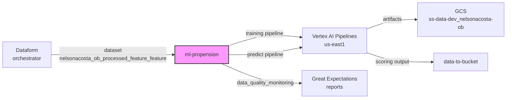
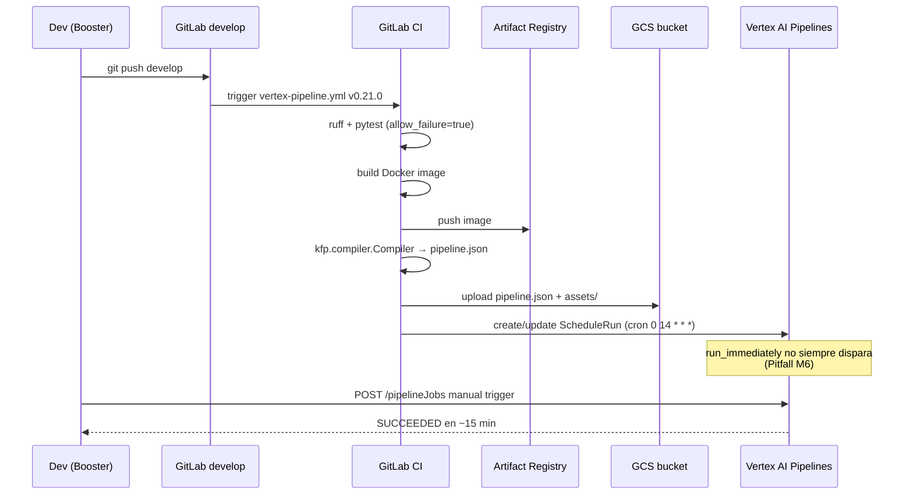
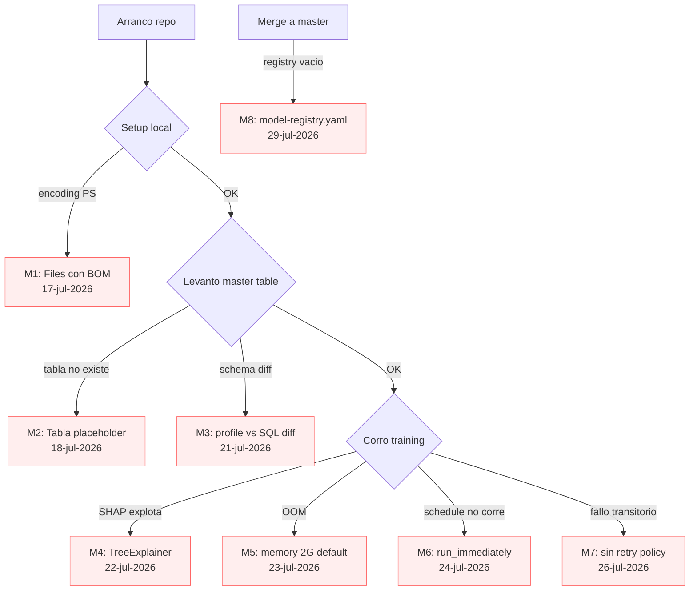

# 03. ml-propension — Modelo de propensión con Vertex AI Pipelines

> Tercer repo y el más caliente del hands-on. Es el **componente ML** que entrena y sirve el modelo de propensión al on-boarding. 34 commits, 8 MRs mergeados: acá es donde vive el 80% del código funcional.

## Índice

- [Qué es este repo](#qué-es-este-repo)
- [Actividad en develop](#actividad-en-develop)
- [Prerequisitos](#prerequisitos)
- [Estructura del repo](#estructura-del-repo)
- [Flujo end-to-end](#flujo-end-to-end)
- [Pitfalls vividos](#pitfalls-vividos)
- [Datos y ejecución operativa](#datos-y-ejecución-operativa)
- [Checklist de entrega](#checklist-de-entrega)
- [Referencias](#referencias)

## Qué es este repo

Es un [Vertex AI Pipelines](../01-glossary.md#vertex-ai-pipelines) componente Python que:

- Define **4 pipelines KFP** (`training`, `predict`, `backtest`, `data_quality_monitoring`).
- Entrena un modelo de **propensión al on-boarding** de nuevos socios sobre la master table producida por [orchestrator](./02-orchestrator.md).
- Empaqueta el modelo, lo compila a JSON con `kfp.compiler.Compiler`, lo sube a GCS y registra el schedule en Vertex AI.
- Se apoya en la **`propension-base-library` v0.6.0** (interna LATAM), que aporta la clase `FFPPropensionBase` con la lógica común de todos los modelos de propensión de LATAM.

El repo hereda del template `cosmos-template-vertex-template` (`.copier-answers.yml → _commit: 0.9.0.rc21-3-g779fa70`).

### Diagrama: rol en el ecosistema



## Actividad en develop

Snapshot al 2026-07-31 (rama `develop`):

| Métrica | Valor |
|---|---|
| Commits totales | 34 |
| Merge Requests mergeados | 8 |
| Archivos totales en repo | 60 |
| Archivos tocados en el historial | 38 (63%) |
| Rango de fechas | 2026-07-16 → 2026-07-30 |
| Intensidad | **Alta** — repo activo, con 5 iteraciones sobre el schema de la master table |

Es el **repo más iterativo** del hands-on: cada MR corresponde a una lección aprendida (schema alineado, monkey-patch SHAP, retry policy, force manual run, etc.). Ver [Pitfalls](#pitfalls-vividos).

## Prerequisitos

Ver [02-prerequisitos-globales](../02-prerequisitos-globales.md). Específico:

- [orchestrator](./02-orchestrator.md) applied en `dev`, con la master table `development_workspace_hands_on_master_cl` poblada en el dataset `nelsonacosta_ob_processed_feature_feature`.
- Bucket `ss-data-dev_nelsonacosta-ob` existente (lo crea `infraestructure` en `custom_infrastructure.tf`).
- Docker base image accesible: `us-east1-docker.pkg.dev/dataplatforms-tools-prod-79e1/dbi/advana-build3.10:latest`.

## Estructura del repo

```
nelsonacosta-ob-ml-propension/
├── .copier-answers.yml        # _commit: 0.9.0.rc21-3-g779fa70
├── .gitlab-ci.yml             # include vertex-pipeline.yml v0.21.0
├── Dockerfile                 # base: advana-build3.10
├── Makefile                   # copier-update, venv, fmt, test, install
├── pyproject.toml             # deps: kfp, propension-base-library==0.6.0, xgboost, sklearn
├── mkdocs.yml + docs/
├── catalog-info.yaml          # system: nelsonacosta-ob
├── model-registry.yaml        # Registry template (Ver Pitfall M8)
├── profiles/
│   ├── application.yaml        # steps: get-master, split-data, fit, ...
│   ├── application-dev.yaml    # schedules, buckets DEV
│   ├── application-int.yaml
│   ├── application-prod.yaml
│   └── application-local.yaml
├── nelsonacosta_ob_ml_propension/
│   ├── __init__.py
│   ├── __version__.py
│   ├── constants.py            # TARGET_COL, DATE_COL, ventanas de tiempo
│   ├── model.py                # NelsonacostaObModel + monkey-patch SHAP
│   └── pipelines.py            # 4 pipelines KFP con @dsl.pipeline
├── assets/
│   ├── inference/get_on_boarding_master.sql
│   ├── training/get_on_boarding_master.sql
│   ├── get_backtest_dataset.sql
│   ├── data_quality_configs/{training,backtest}.yaml
│   └── data_drift_report/config.yaml
├── experiments/*.ipynb         # notebooks EDA + hyperparam tuning
├── tests/test_base.py
└── .version
```

Archivo autoritativo en GitLab: [nelsonacosta-ob-ml-propension](https://gitlab.com/latamairlines/data/shared-services/cross/nelsonacosta-ob/nelsonacosta-ob-ml-propension/-/tree/develop).

## Flujo end-to-end

### 1. Scaffold Copier

```powershell
copier copy git@gitlab.com:latamairlines/data/data-ai-ops/cosmos/cosmos-template/cosmos-template-vertex-template.git nelsonacosta-ob-ml-propension
```

Respuestas relevantes (`.copier-answers.yml`):

```yaml
component_name: nelsonacosta-ob-ml-propension
product_name: nelsonacosta-ob
service_name: ml-propension
model_type: base
enable_rts: false
enable_explain: false
team: ai-sharedservices
DOCKER_BASE_IMAGE_LLM: us-east1-docker.pkg.dev/dataplatforms-tools-prod-79e1/dbi/advana-build3.10:latest
GCP_PROJECT_ID_DEV: ss-data-dev
GCP_PROJECT_ID_PROD: ss-data-prod
```

### 2. Ambiente local (Windows PowerShell)

Toda la ejecución en la laptop corporativa (Windows). Comandos canónicos:

```powershell
# Crear venv con uv (respeta pyproject.toml)
uv venv --seed .venv
.\.venv\Scripts\Activate.ps1

# Instalar en editable + deps propension-base-library desde JFrog LATAM
uv pip install -e ".[dev,test]" --index-strategy unsafe-best-match

# Formato + tests
make fmt
pytest -x
```

Notas: uv es el package manager estándar de Cosmos. `--index-strategy unsafe-best-match` es necesario porque `propension-base-library` vive en el JFrog interno.

### 3. Perfiles (`profiles/*.yaml`)

Son la **fuente de verdad de configuración runtime**. Se cargan por ambiente vía `application-{dev,int,prod}.yaml` sobre el base `application.yaml`.

`application.yaml` — schema que consume `FFPPropensionBase`:

```yaml
product_name: nelsonacosta-ob
service_name: ml-propension

general:
  project_id: ss-data-dev

steps:
  get-master:
    filename: get_on_boarding_master.sql
    extra_args:
      project: ss-data-dev
      dataset: nelsonacosta_ob_processed_feature_feature

  split-data:
    target: TARGET_3M
    test_size: 0.2
    stratify: true

  fit:
    framework: sklearn
    importance_subsample: 0.1
    columns_to_drop: [CUSTOMER_ID, snapshot_date, YM]
```

`application-dev.yaml` — schedules y buckets:

```yaml
bucket_name: ss-data-dev_nelsonacosta-ob
project_id: ss-data-dev
location: us-east1
pipelines:
  training:
    schedule:
      cron: "0 14 * * *"
      run_immediately: true
    pipelines_to_trigger:
      predict: {}
  predict:
    schedule:
      cron: "0 14 * * *"
    arguments:
      training_pipeline_name: 'training'
  backtest:
    schedule:
      cron: "0 0 1 * *"
  data_quality_monitoring:
    arguments:
      environment: 'dev'
    schedule:
      run_immediately: true
```

Punto clave: `run_immediately: true` **no siempre dispara la primera corrida**. Ver [Pitfall M6](#pitfall-m6).

### 4. Pipelines (KFP) — `pipelines.py`

Cuatro definiciones `@dsl.pipeline` que arman el DAG:

```python
@dsl.pipeline(name="training")
def training(init_args: dict, environment: str) -> None:
    get_data_task = NelsonacostaObModel.get_master(init_args__=init_args, stage="training")
    preprocess_task = NelsonacostaObModel.preprocessing_training(
        init_args__=init_args,
        raw_data=get_data_task.outputs["master_table"],
    ).set_memory_request("16G").set_cpu_request("4")

    split_data_task = NelsonacostaObModel.split_data(...)
    fit_task = NelsonacostaObModel.fit(...)
```

Los steps son **componentes KFP** decorados con `@as_component` en `model.py`. Cada uno declara sus resource requests (16 GB / 4 CPU) — el default de Vertex es 2 GB, insuficiente para 18.5M rows.

### 5. Modelo (`model.py`) — monkey-patch SHAP

`propension_base_library.FFPPropensionBase` intenta `shap.TreeExplainer(model)` en el step `_feature_importance_report`. Falla con:

```
InvalidModelError: Model type not yet supported by TreeExplainer:
    <class 'sklearn.pipeline.Pipeline'>
```

Fix (portado 1:1 desde repo hermano ya funcionando):

```python
def _patched_feature_importance_report(model, x_data, ...):
    if isinstance(model, SKPipeline):
        _logger.warning("Skipping SHAP for sklearn.pipeline.Pipeline")
        return None
    return _original_feature_importance(model, x_data, ...)

_pbl_base._feature_importance_report = _patched_feature_importance_report
```

El patch va al **inicio de `model.py`**, antes de instanciar `FFPPropensionBase`. Sin esto no arranca el fit.

### 6. Master query SQL

`assets/{training,inference}/get_on_boarding_master.sql` — SQL parametrizado, resuelto por `str.format()` desde `profiles.application.yaml`:

```sql
SELECT
    CUSTOMER_ID, snapshot_date, YM,
    N_TICKETS_DOM, N_TICKETS_REG, N_TICKETS_LH, N_TICKETS_TOTAL,
    FARE_AVG_DOM, FARE_AVG_REG, FARE_AVG_LH,
    FARE_SUM_DOM, FARE_SUM_REG, FARE_SUM_LH,
    -- 7 familias × 3 regiones = 21 features
    N_TICKETS_FARE_BASIC_DOM, ... N_TICKETS_FARE_PREMIUM_LH,
    -- Behavior + Digital placeholders + Loyalty + Target
    ANTIQUITY_DAYS, AVG_DAYS_BUY_FLY, AVG_DAYS_ADV_PURCHASE,
    TARGET_3M
FROM `{project}.{dataset}.development_workspace_hands_on_master_cl`
```

Positive rate validado: **19.63%** (17.7–20.8% por snapshot, sin drift). Ver [pitfall #52 real](../pitfall-52-ga4-real-table-name) — el nombre de tabla debe ser el real, no el placeholder del template.

### 7. Data Quality — Great Expectations

`assets/data_quality_configs/training.yaml` define validaciones por columna:

```yaml
expectations:
  - column: TARGET_3M
    expectations:
      - type: expect_column_values_to_be_in_set
        value_set: [0, 1]
      - type: expect_column_mean_to_be_between
        min_value: 0.05
        max_value: 0.35   # positive rate esperado 19.63%, con margen
  - column: AGE
    expectations:
      - type: expect_column_values_to_be_between
        min_value: 0
        max_value: 120
```

El pipeline `data_quality_monitoring` corre estas expectativas contra la master table y publica el reporte en GCS. Falla el pipeline si una expectativa cae bajo el umbral.

### 8. CI/CD — `.gitlab-ci.yml`

Include a la pipeline canónica de Vertex de Cosmos:

```yaml
include:
  - project: "latamairlines/data/data-ai-ops/cosmos/cicd-pipelines/base-pipelines"
    file: "templates/vertex-pipeline.yml"
    inputs:
      product_name: nelsonacosta-ob
      service_name: ml-propension
      version: "0.21.0"
      allow_test_failure: true
      allow_lint_failure: true
```

Los `allow_*_failure: true` son **provisionales del hands-on** — no ir con eso a producción real. La pipeline hace: build docker, compile KFP → JSON, push a GCS, register schedule en Vertex.

### Diagrama: pipeline de deploy end-to-end



## Pitfalls vividos

### Árbol de pitfalls por fase



<a id="pitfall-m1"></a>
### Pitfall M1 — PowerShell escribe BOM (17-jul-2026)

**Síntoma:** El pipeline falla en YAML parsing: `mapping values are not allowed here`. El archivo se ve bien en el editor.

**Causa:** `Set-Content` en PowerShell por defecto escribe `UTF-8 con BOM`. Vertex/KFP parsea con Python `yaml.safe_load()` que no tolera BOM al inicio de archivo.

**Solución:** Forzar `utf-8-sig` al escribir desde PowerShell:

```powershell
[System.IO.File]::WriteAllText(
  "profiles/application-dev.yaml",
  $content,
  [System.Text.UTF8Encoding]::new($false)   # $false = sin BOM
)
```

O simplemente editar los YAML con VSCode y guardarlos como `UTF-8` (no `UTF-8 with BOM`).

<a id="pitfall-m2"></a>
### Pitfall M2 — Tabla del template no existe (18-jul-2026)

**Síntoma:** El SQL `get_on_boarding_master.sql` fallaba con `Not found: Table ebiz_google_analytics_4.ebiz_google_analytics_4_events`.

**Causa:** El template Copier trae un nombre de tabla **placeholder** que **no coincide con la real en GA4/BigQuery LATAM**. Ver [pitfall #52](../pitfall-52-ga4-real-table-name).

**Solución:** Confirmar el nombre real con Staff LATAM y reemplazar en `assets/{training,inference,backtest}/*.sql` **y** en `application.yaml → steps.get-master.extra_args.dataset`. El nombre real en el hands-on es `development_workspace_hands_on_master_cl`.

<a id="pitfall-m3"></a>
### Pitfall M3 — Schema profile ↔ SQL fuera de sync (21-jul-2026)

**Síntoma:** El fit falla con `KeyError: 'TARGET_3M'` o `columns_to_drop` menciona columnas que ya no existen.

**Causa:** El SQL evoluciona (agrego/saco columnas), pero `application.yaml → steps.split-data.target` y `steps.fit.columns_to_drop` no se actualizan.

**Solución:** Los tres archivos son un **contrato** único: SQL, `application.yaml` y `constants.py`. Cada MR que toque el SQL debe tocar los tres. Regla: si agrego una columna en el SELECT, la agrego (o la dropeo explícito) en `application.yaml`.

<a id="pitfall-m4"></a>
### Pitfall M4 — SHAP TreeExplainer explota con sklearn.Pipeline (22-jul-2026)

**Síntoma:**

```
InvalidModelError: Model type not yet supported by TreeExplainer:
    <class 'sklearn.pipeline.Pipeline'>
```

**Causa:** `FFPPropensionBase._feature_importance_report` asume árbol o modelo lineal directo, no un `sklearn.pipeline.Pipeline` que envuelve `StandardScaler + LogisticRegression`.

**Solución:** Monkey-patch en `model.py` (ver [sección 5](#5-modelo-modelpy--monkey-patch-shap)). Salta SHAP solo para `SKPipeline`, deja el resto intacto. Es una solución **puente** hasta que la base library soporte pipelines nativamente.

<a id="pitfall-m5"></a>
### Pitfall M5 — OOM en preprocess con default de memoria (23-jul-2026)

**Síntoma:** El step `preprocessing_training` termina con `OOMKilled` a los ~4 minutos. La master tiene 18.5M rows × 47 cols.

**Causa:** El default de KFP en Vertex es **2 GB / 1 CPU** — insuficiente.

**Solución:** En `pipelines.py`, encadenar `.set_memory_request("16G").set_cpu_request("4")` (y los `_limit` correspondientes) en cada step que procese la master completa: `preprocessing_training`, `split_data`, `fit`. Ver [sección 4](#4-pipelines-kfp--pipelinespy).

<a id="pitfall-m6"></a>
### Pitfall M6 — `run_immediately: true` no dispara la primera corrida (24-jul-2026)

**Síntoma:** Configuro `run_immediately: true` en `application-dev.yaml`, el pipeline se registra en Vertex, el schedule aparece — pero no hay ejecución hasta el próximo cron.

**Causa:** El flag `run_immediately` solo aplica en el momento en que se **crea** el schedule por primera vez. Si el schedule ya existía y se actualiza, no re-dispara. Es comportamiento documentado (pero fácil de pasar por alto).

**Solución:** Forzar la corrida manual vía REST. `gcloud` no tiene un flag directo para esto, así que la ruta canónica es POST directo a `/v1/pipelineJobs`:

```bash
gcloud auth print-access-token > /tmp/token.txt
TOKEN=$(cat /tmp/token.txt)

curl -X POST \
  -H "Authorization: Bearer ${TOKEN}" \
  -H "Content-Type: application/json" \
  "https://us-east1-aiplatform.googleapis.com/v1/projects/ss-data-dev/locations/us-east1/pipelineJobs?pipelineJobId=training-manual-$(date +%s)" \
  -d @manual-run.json
```

Donde `manual-run.json` referencia el `pipelineSpec` publicado en GCS. Guardar el patrón — se reusa en cada iteración de debug.

<a id="pitfall-m7"></a>
### Pitfall M7 — Sin retry policy, fallos transitorios matan el schedule (26-jul-2026)

**Síntoma:** El `predict` diario falla ~1 de cada 5 veces por errores transitorios de BigQuery API. El schedule sigue armado pero la corrida se pierde.

**Causa:** KFP no configura retries por defecto. Un fallo transitorio (`BigQuery API rate limit exceeded`, `Deadline exceeded`) es fatal.

**Solución:** Agregar retry en cada task `preprocessing_*` y `get_master`:

```python
get_data_task = (
    NelsonacostaObModel.get_master(init_args__=init_args, stage="training")
    .set_retry(num_retries=3, backoff_duration="60s", backoff_factor=2.0, backoff_max_duration="600s")
)
```

Aplicar como mínimo a los steps de I/O externa (BigQuery, GCS).

<a id="pitfall-m8"></a>
### Pitfall M8 — `model-registry.yaml` queda vacío al mergear (29-jul-2026)

**Síntoma:** El MR pasa CI pero el catálogo Backstage muestra el modelo con description vacío. En governance review LATAM te lo rebotan.

**Causa:** El template deja `model-registry.yaml` con los ejemplos **comentados** — nadie los descomenta.

**Solución:** Descomentar y rellenar antes de mergear:

```yaml
registry:
  version: "1.0"
models:
  - model_id: nelsonacosta-ob-propension
    model_name: Nelsonacosta-ob On-Boarding Propension
    model_description: >
      Predicts 3-month propensity to on-board using logistic regression
      over customer flight history, fare mix, and behavior features.
      Training window 12 months, prediction window 3 months.
```

Tres campos, ni uno más (el YAML rechaza otros). Esto se valida en CI si la version del template lo incluye.

## Datos y ejecución operativa

### Artefactos SQL/Dataform en este repo

Este repo tiene 3 archivos SQL reales que alimentan training, inference y backtest. Se copian sanitizados a `../assets/dataform/ml-propension/`. La fuente autoritativa siempre es GitLab LATAM.

| Path GitLab | Descripción | Copia sanitizada |
|-------------|-------------|------------------|
| `assets/training/get_on_boarding_master.sql` | Master table de training (47 cols, `LIMIT 100000`) | [`../assets/dataform/ml-propension/training/get_on_boarding_master.sql`](../assets/dataform/ml-propension/training/get_on_boarding_master.sql) |
| `assets/inference/get_on_boarding_master.sql` | Master table de inference (mismo schema, sin LIMIT) | [`../assets/dataform/ml-propension/inference/get_on_boarding_master.sql`](../assets/dataform/ml-propension/inference/get_on_boarding_master.sql) |
| `assets/get_backtest_dataset.sql` | JOIN predictions × ground_truth | [`../assets/dataform/ml-propension/backtest/get_backtest_dataset.sql`](../assets/dataform/ml-propension/backtest/get_backtest_dataset.sql) |

Los tres SQLs usan placeholders Jinja `{project}` y `{dataset}` que se resuelven vía `profiles/application-dev.yaml`. La tabla base es `{project}.{dataset}.development_workspace_hands_on_master_cl` — se lee, no se crea desde este repo.

### Comandos operativos desde la Dell (PowerShell)

Setup inicial (una vez por Dell):

```powershell
gcloud auth application-default login
gcloud config set project latam-hands-on-nelsonacosta-ob

# Python + Poetry para levantar el modelo
python -m venv .venv
.\.venv\Scripts\Activate.ps1
pip install poetry
poetry install
```

Ciclo local — smoke test del pipeline:

```powershell
cd C:\latam\nelsonacosta-ob-ml-propension
git checkout develop

poetry run python -m ml_propension.pipelines.smoke_test `
  --profile=application-dev `
  --project=latam-hands-on-nelsonacosta-ob
```

Trigger de Vertex AI Pipelines (patrón validado: REST directo a `/v1/pipelineJobs`, no `gcloud ai custom-jobs`):

```powershell
$PROJECT = "latam-hands-on-nelsonacosta-ob"
$REGION = "us-east4"
$TOKEN = (gcloud auth print-access-token)
$PIPELINE_JSON = "pipeline.json"

# Force manual run (NO usar gcloud ai custom-jobs — usar REST directo)
$body = @{
  displayName = "propension-manual-$(Get-Date -Format 'yyyyMMdd-HHmm')"
  templateUri = "gs://nelsonacosta-ob-pipelines/$PIPELINE_JSON"
  runtimeConfig = @{
    gcsOutputDirectory = "gs://nelsonacosta-ob-pipelines/runs/"
    parameterValues = @{ env = "dev" }
  }
} | ConvertTo-Json -Depth 10

# BOM issue: forzar UTF-8 sin BOM
[System.IO.File]::WriteAllText("$PWD\body.json", $body, [System.Text.UTF8Encoding]::new($false))

curl -X POST `
  "https://$REGION-aiplatform.googleapis.com/v1/projects/$PROJECT/locations/$REGION/pipelineJobs" `
  -H "Authorization: Bearer $TOKEN" `
  -H "Content-Type: application/json; charset=utf-8" `
  --data-binary "@body.json"
```

Verificación de artifacts en GCS post-run:

```powershell
gsutil ls -r gs://nelsonacosta-ob-pipelines/runs/ | Select-Object -Last 20
gsutil cat gs://nelsonacosta-ob-pipelines/runs/RUN_ID/metrics.json | jq
```

### Queries de verificación (bq CLI)

Row count de la master table (validar que la ingesta previa corrió):

```powershell
$Q = @"
SELECT COUNT(*) AS n,
       MIN(fecha_particion) AS min_fecha,
       MAX(fecha_particion) AS max_fecha
FROM \`latam-hands-on-nelsonacosta-ob.nelsonacosta_ob_dev.development_workspace_hands_on_master_cl\`
"@
bq query --use_legacy_sql=false --format=pretty $Q
```

Schema diff entre training e inference (deben coincidir en cols excepto el `LIMIT`):

```powershell
bq show --schema --format=prettyjson `
  latam-hands-on-nelsonacosta-ob:nelsonacosta_ob_dev.training_master `
  > training_schema.json

bq show --schema --format=prettyjson `
  latam-hands-on-nelsonacosta-ob:nelsonacosta_ob_dev.inference_master `
  > inference_schema.json

# Diff col names
diff (cat training_schema.json | jq -r '.[].name' | sort) `
     (cat inference_schema.json | jq -r '.[].name' | sort)
```

Freshness check antes de gatillar un training:

```powershell
$Q = @"
SELECT DATE_DIFF(CURRENT_DATE(), MAX(fecha_particion), DAY) AS dias_stale
FROM \`latam-hands-on-nelsonacosta-ob.nelsonacosta_ob_dev.development_workspace_hands_on_master_cl\`
HAVING dias_stale > 2
"@
bq query --use_legacy_sql=false --format=pretty $Q
```

Comparación de dos snapshots de predicciones (para backtest):

```powershell
$Q = @"
WITH a AS (SELECT customer_id, score FROM \`...predictions_20260728\`),
     b AS (SELECT customer_id, score FROM \`...predictions_20260731\`)
SELECT COUNT(*) AS overlap,
       AVG(ABS(a.score - b.score)) AS mean_abs_delta,
       CORR(a.score, b.score) AS score_correlation
FROM a JOIN b USING (customer_id)
"@
bq query --use_legacy_sql=false --format=pretty $Q
```

### Rollback / re-ejecución

Cancelar un `pipelineJob` en curso:

```powershell
gcloud ai pipeline-jobs cancel PIPELINE_JOB_ID `
  --region=us-east4 `
  --project=latam-hands-on-nelsonacosta-ob
```

Re-correr solo el step de inference (asumiendo pipeline con `enable_caching=true`):

```powershell
# En pipeline.json, tocar solo el nodo "inference" y re-submitir
# El caching de KFP reutiliza los artifacts de training del run previo
```

Bajar el último modelo entrenado para inspección local:

```powershell
gsutil ls gs://nelsonacosta-ob-pipelines/runs/ | Select-Object -Last 1
gsutil -m cp -r gs://nelsonacosta-ob-pipelines/runs/RUN_ID/model/ ./last-model/
```

### Assets sanitizados en este repo de playbooks

- [`../assets/dataform/ml-propension/training/get_on_boarding_master.sql`](../assets/dataform/ml-propension/training/get_on_boarding_master.sql)
- [`../assets/dataform/ml-propension/inference/get_on_boarding_master.sql`](../assets/dataform/ml-propension/inference/get_on_boarding_master.sql)
- [`../assets/dataform/ml-propension/backtest/get_backtest_dataset.sql`](../assets/dataform/ml-propension/backtest/get_backtest_dataset.sql)

## Checklist de entrega

Antes de mergear a `master`:

- [ ] `make fmt` y `pytest` verdes localmente.
- [ ] `.copier-answers.yml → _commit` fijado a tag/ref conocido.
- [ ] `application-{dev,int,prod}.yaml` con `bucket_name`, `project_id`, `location` correctos.
- [ ] SQL de `assets/{training,inference,backtest}/` referencia la tabla real (no placeholder).
- [ ] `steps.split-data.target`, `steps.fit.columns_to_drop` y el SQL están en sync ([Pitfall M3](#pitfall-m3)).
- [ ] Monkey-patch SHAP presente en `model.py` si el modelo usa `sklearn.pipeline.Pipeline`.
- [ ] Resource requests (16G / 4 CPU) en steps pesados.
- [ ] Retry policy en steps de I/O externa.
- [ ] `model-registry.yaml` completo (los 3 campos, sin extras).
- [ ] Primer run manual disparado vía REST y `SUCCEEDED`.

Verificación post-deploy:

```bash
# Schedules registrados
gcloud ai schedules list --region=us-east1 --project=ss-data-dev

# Último pipeline run
gcloud ai pipeline-jobs list --region=us-east1 --project=ss-data-dev \
  --filter='displayName:training-*' --sort-by=~createTime --limit=1

# Artifacts del pipeline en GCS
gsutil ls gs://ss-data-dev_nelsonacosta-ob/pipeline_root/
```

## Referencias

- [Repo GitLab](https://gitlab.com/latamairlines/data/shared-services/cross/nelsonacosta-ob/nelsonacosta-ob-ml-propension) — fuente autoritativa
- [pipelines.py](https://gitlab.com/latamairlines/data/shared-services/cross/nelsonacosta-ob/nelsonacosta-ob-ml-propension/-/blob/develop/nelsonacosta_ob_ml_propension/pipelines.py)
- [model.py](https://gitlab.com/latamairlines/data/shared-services/cross/nelsonacosta-ob/nelsonacosta-ob-ml-propension/-/blob/develop/nelsonacosta_ob_ml_propension/model.py) — monkey-patch SHAP
- [profiles/application.yaml](https://gitlab.com/latamairlines/data/shared-services/cross/nelsonacosta-ob/nelsonacosta-ob-ml-propension/-/blob/develop/profiles/application.yaml)
- [propension-base-library](https://gitlab.com/latamairlines/data/data-ai-ops/cosmos/propension-base-library) v0.6.0
- [cosmos-template-vertex-template](https://gitlab.com/latamairlines/data/data-ai-ops/cosmos/cosmos-template/cosmos-template-vertex-template) — template Copier
- [Vertex AI Pipelines REST reference](https://cloud.google.com/vertex-ai/docs/reference/rest/v1/projects.locations.pipelineJobs)
- Anterior: [02-orchestrator](./02-orchestrator.md)
- Siguiente: [04-data-to-bucket](./04-data-to-bucket.md)
