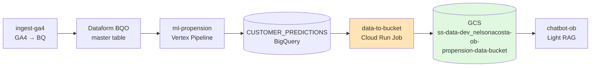
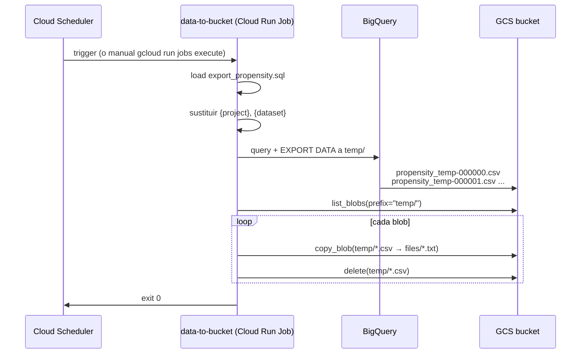

# 04 · data-to-bucket — Exportar BigQuery a GCS para consumo RAG

> Cuarto eslabón de la cadena. Toma las predicciones que dejó `ml-propension` en BigQuery, las convierte a un formato "texto plano por cliente" y las deposita en un bucket GCS con extensión `.txt` para que el chatbot pueda ingestarlas vía Light RAG.

## Índice

- [Contexto de negocio](#contexto-de-negocio)
- [Arquitectura del repo](#arquitectura-del-repo)
- [Diagramas](#diagramas)
- [Setup local (Dell LATAM)](#setup-local-dell-latam)
- [Flujo de trabajo](#flujo-de-trabajo)
- [Actividad real en `develop`](#actividad-real-en-develop)
- [Pitfalls vividos](#pitfalls-vividos)
- [Datos y ejecución operativa](#datos-y-ejecución-operativa)
- [Checklist de entrega](#checklist-de-entrega)
- [Referencias cruzadas](#referencias-cruzadas)

---

## Contexto de negocio

El componente `ml-propension` deja una tabla `CUSTOMER_PREDICTIONS` en BigQuery con `(CUSTOMER_ID, PROPENSITY, snapshot_date)` por cada corrida del pipeline Vertex. El chatbot de onboarding necesita esa información pero **no consulta BigQuery directamente** — el patrón LATAM para GenAI + datos operativos es Light RAG sobre archivos de texto en un bucket GCS.

`data-to-bucket` es el puente:

1. Corre como **Cloud Run Job** (no servicio, no expone endpoint HTTP).
2. Se dispara por Cloud Scheduler / triggered manualmente / encadenado al pipeline Vertex.
3. Ejecuta un SQL sobre `CUSTOMER_PREDICTIONS` que arma **una frase natural por cliente** (formato `"Customer 12345 has ALTA propensity (0.87) for period 2026-07-31"`).
4. Exporta el resultado a GCS como CSVs temporales (`temp/propensity_temp-*.csv`).
5. Renombra los CSVs a `.txt` en la carpeta `files/` para que el ingester del chatbot los detecte.
6. Borra los CSVs temporales.

Por qué "una frase por cliente y no JSON": Light RAG indexa mejor lenguaje natural que estructuras, y el chatbot resuelve consultas del tipo *"¿qué propensión tiene el cliente 12345?"* buscando substrings, no queries SQL.

---

## Arquitectura del repo

```
nelsonacosta-ob-data-to-bucket/
├── nelsonacosta_ob_data_to_bucket/
│   ├── __init__.py
│   └── __main__.py                 # Entry point Cloud Run Job
├── assets/
│   └── export_propensity.sql       # SQL de exportación con placeholders {project}/{dataset}
├── profiles/
│   ├── application.yaml            # perfil default
│   ├── application-dev.yaml        # project-id: ss-data-dev
│   ├── application-prod.yaml       # project-id: ss-data-prod
│   ├── application-local.yaml
│   └── application-test.yaml       # project-id: fake-project
├── config/
│   └── agent-pod.yaml              # spec del pod para el CI
├── tests/
│   └── test_base.py                # mockea google.cloud.storage y bigquery_to_storage
├── Dockerfile                      # base: advana-dbi-base-python3.10-slim-bullseye
├── Makefile                        # targets Linux
├── commands.ps1                    # equivalente PowerShell para Dell LATAM
├── pyproject.toml                  # setuptools + ruff
├── requirements.txt                # cosmos.core, cosmos.gcp, google-cloud-*
├── requirements-dev.txt
├── requirements-test.txt
├── .gitlab-ci.yml                  # incluye cloud-run-pipeline.yml (base-pipelines)
├── catalog-info.yaml               # Backstage: type openapi, lifecycle production
├── rc.json                         # metadata JIRA RC Builder
└── .version
```

Puntos clave del diseño:

- **Sin lógica de negocio en Python**: el SQL vive en `assets/export_propensity.sql`, el `__main__.py` sólo orquesta `bigquery_to_storage` + rename `.csv → .txt`.
- **Constantes hardcodeadas** en `__main__.py` (`PROJECT_ID`, `DATASET`, `BUCKET`). Convención del scaffold Cosmos para jobs simples: se resuelve por perfil sólo el `project-id`, el resto es literal.
- **CI base**: incluye `cloud-run-pipeline.yml` del repo `base-pipelines`. Ese template lintea, testea, buildea imagen, la sube a Artifact Registry, y crea/actualiza el Cloud Run Job.
- **Backstage `type: openapi`** — es un legado del template; en la práctica no expone OpenAPI (es un job). Lo dejamos así para no romper el catálogo.

---

## Diagramas

### Diagrama 1: Cadena de datos completa



### Diagrama 2: Flujo interno del job



### Diagrama 3: Ciclo de dev en `develop`

```mermaid
gitGraph
    commit id: "[COSMOS] Initial commit"
    branch feature/implement-data-to-bucket
    commit id: "impl: __main__ + SQL + tests"
    checkout develop
    merge feature/implement-data-to-bucket tag: "MR #1"
    branch fix/dockerfile-copy-assets
    commit id: "fix: COPY assets/ en Dockerfile"
    checkout develop
    merge fix/dockerfile-copy-assets tag: "MR #2"
    branch fix/sql-schema-mismatch
    commit id: "fix: snapshot_date lower, cols upper"
    checkout develop
    merge fix/sql-schema-mismatch tag: "MR #3"
```

---

## Setup local (Dell LATAM)

Prerequisitos globales cubiertos en [02-prerequisitos-globales.md](../02-prerequisitos-globales.md). Específico para este repo:

```powershell
# 1. Clonar
git clone https://gitlab.com/latamairlines/data/shared-services/cross/nelsonacosta-ob/nelsonacosta-ob-data-to-bucket.git
cd nelsonacosta-ob-data-to-bucket
git checkout develop

# 2. Venv + deps
.\commands.ps1 venv
.\.venv\Scripts\activate
.\commands.ps1 install

# 3. Auth GCP (ADC + gcloud)
gcloud auth login
gcloud auth application-default login
gcloud config set project ss-data-dev

# 4. Verificar acceso al bucket
gsutil ls gs://ss-data-dev_nelsonacosta-ob-propension-data-bucket/

# 5. Verificar acceso al dataset
bq ls ss-data-dev:NELSONACOSTA_OB_PROPENSION_DATA
```

Ejecución local:

```powershell
# Corre el job apuntando a ss-data-dev (mismo project que dev)
$env:APP_ENVIRONMENT = "local"
python -m nelsonacosta_ob_data_to_bucket
```

Salida esperada:

```
Iniciando Cloud Run Job...
Iniciando exportacion desde BigQuery hacia GCS...
Copiado temp/propensity_temp-000000.csv -> files/propensity_temp-000000.txt
Eliminado temporal temp/propensity_temp-000000.csv
...
Exportacion completada exitosamente.
```

---

## Flujo de trabajo

1. **Crear branch de feature/fix desde `develop`**

   ```powershell
   git checkout develop
   git pull --rebase
   git checkout -b feature/mi-cambio
   ```

2. **Editar SQL o Python**. Cambios típicos:
   - Modificar `assets/export_propensity.sql` (formato de frase, agregar campos).
   - Ajustar `__main__.py` si cambian los nombres de dataset/bucket.
   - Nuevo perfil `profiles/application-<env>.yaml`.

3. **Test local**

   ```powershell
   .\commands.ps1 test
   .\commands.ps1 lint
   ```

4. **Test de integración (opcional pero recomendado)** — corre el job contra `ss-data-dev`:

   ```powershell
   $env:APP_ENVIRONMENT = "local"
   python -m nelsonacosta_ob_data_to_bucket
   gsutil ls gs://ss-data-dev_nelsonacosta-ob-propension-data-bucket/files/ | Select-Object -First 5
   ```

5. **Commit + push**

   ```powershell
   git add -A
   git commit -m "feat: descripción del cambio"
   git push origin feature/mi-cambio
   ```

6. **MR** contra `develop`. Reviewer: `<REVIEWER_NEURALWORKS>` aprueba, mergeás vos por UI (no vía API).

7. **CI verde en `develop`** → despliega automáticamente al Cloud Run Job de `ss-data-dev`.

8. **Verificación post-deploy**:

   ```powershell
   gcloud run jobs execute nelsonacosta-ob-data-to-bucket --region us-east1 --project ss-data-dev
   gcloud run jobs executions list --job nelsonacosta-ob-data-to-bucket --region us-east1 --project ss-data-dev --limit 5
   ```

---

## Actividad real en `develop`

| Métrica                    | Valor                                            |
|----------------------------|--------------------------------------------------|
| Rango de fechas            | 2026-07-22 → 2026-07-23                          |
| Commits totales            | 7 (3 merges de MR + 4 de branches)               |
| Merge Requests             | 3 (feature/implement, fix/dockerfile, fix/sql)   |
| Archivos tocados           | `__main__.py`, `Dockerfile`, `export_propensity.sql`, `tests/test_base.py` |
| Cobertura test             | 65% (mínimo forzado por `--cov-fail-under 65`)   |
| LOC efectivas (`__main__`) | ~55                                              |

Historial condensado:

| Fecha       | Commit    | MR                                | Foco                                          |
|-------------|-----------|-----------------------------------|-----------------------------------------------|
| 22-jul-2026 | `f17a23e` | `feature/implement-data-to-bucket`| Implementación inicial: main + SQL + tests    |
| 23-jul-2026 | `7612cd1` | `fix/dockerfile-copy-assets`      | Dockerfile no copiaba `assets/` → job crasheaba |
| 23-jul-2026 | `c2163e8` | `fix/sql-schema-mismatch`         | `snapshot_date` en lowercase, resto uppercase |

---

## Pitfalls vividos

### Pitfall D1 — Dataset y bucket case-sensitive (22-jul-2026)

**Síntoma**: `NotFound: 404 Not found: Dataset ss-data-dev:nelsonacosta_ob_propension_data`.

**Causa**: en BigQuery los datasets son case-sensitive. El dataset se creó con nombre en MAYÚSCULAS (`NELSONACOSTA_OB_PROPENSION_DATA`) desde el Terraform de `infraestructure`, pero el código en `__main__.py` lo referenciaba en lowercase.

**Solución**:

```python
# NO:
DATASET = "nelsonacosta_ob_propension_data"

# SÍ:
DATASET = "NELSONACOSTA_OB_PROPENSION_DATA"
```

**Regla**: cuando dudes, verificá con `bq ls <project>:<dataset>` — el output te muestra el nombre exacto tal como fue creado.

---

### Pitfall D2 — Dockerfile no copiaba `assets/` (23-jul-2026)

**Síntoma**: job crasheaba en Cloud Run con `FileNotFoundError: [Errno 2] No such file or directory: 'export_propensity.sql'`.

**Causa**: el `Dockerfile` copiaba `profiles/` pero se olvidaba `assets/`. Localmente andaba porque el archivo estaba en el filesystem, pero adentro del container no.

**Solución** (`MR #2` — `fix/dockerfile-copy-assets`):

```dockerfile
# Agregar antes del COPY nelsonacosta_ob_data_to_bucket/
RUN mkdir assets
COPY assets/ assets/
```

**Regla**: cualquier carpeta que el runtime necesite leer (SQLs, JSONs, YAMLs) tiene que estar explícitamente en el `Dockerfile`. `pyproject.toml [tool.setuptools.package-data]` sólo aplica al build del wheel, no al Docker.

---

### Pitfall D3 — Schema mismatch en columnas (23-jul-2026)

**Síntoma**: query fallaba con `Unrecognized name: snapshot_date at [12:15]`.

**Causa**: `ml-propension` genera la tabla `CUSTOMER_PREDICTIONS` con **columnas de datos en UPPERCASE** (`CUSTOMER_ID`, `PROPENSITY`) pero **columnas de metadata en lowercase** (`snapshot_date`, `created_at`). El SQL original usaba `SNAPSHOT_DATE` esperando el mismo case que el resto.

**Solución** (`MR #3` — `fix/sql-schema-mismatch`):

```sql
-- assets/export_propensity.sql
-- NO: CAST(SNAPSHOT_DATE AS STRING)
-- SÍ: CAST(snapshot_date AS STRING)
```

**Regla**: antes de escribir el SQL, siempre `bq show --schema <project>:<dataset>.<table>` para ver el case exacto de cada columna. La convención de LATAM no es uniforme dentro de una misma tabla.

---

### Pitfall D4 — CSV con salto de línea + Light RAG (25-jul-2026)

**Síntoma**: el chatbot devolvía respuestas truncadas o duplicadas para el mismo cliente. Detectado post-deploy en dev.

**Causa**: el ingester de Light RAG del chatbot lee `.txt` esperando **una unidad de conocimiento por línea**. Los CSVs que exporta BigQuery vienen con header (`content`) + una línea por row. El header entraba como un "documento" más y las frases largas a veces se cortaban.

**Solución** (aplicada en `chatbot-ob`, no en este repo, pero relevante conocerla acá):

- El chatbot descarta la primera línea de cada `.txt` (header).
- El SQL genera `content` como **una sola línea de texto natural** sin comas ni comillas conflictivas — la función `CONCAT` con strings literales evita que BigQuery meta caracteres de escape.

**Regla**: cuando dos repos dependen del formato exacto de un archivo (contract implícito), documentar el contract en el playbook de ambos.

---

### Pitfall D5 — Bucket no existe / permisos SA (falla clásica) (22-jul-2026)

**Síntoma**: `Forbidden: 403 GET https://storage.googleapis.com/... : nelsonacosta-ob-data-to-bucket-sa@ss-data-dev.iam.gserviceaccount.com does not have storage.objects.create access`.

**Causa**: el bucket lo crea el Terraform del repo `infraestructure`, con nombre `ss-data-dev_nelsonacosta-ob-propension-data-bucket` (guion bajo + guiones). Cuando `data-to-bucket` se despliega antes de que `infraestructure` haya aplicado el bucket, o cuando el SA del job no tiene rol `roles/storage.objectAdmin` sobre ese bucket, la exportación falla.

**Solución**:

```bash
# 1. Verificar que el bucket existe
gsutil ls -b gs://ss-data-dev_nelsonacosta-ob-propension-data-bucket

# 2. Verificar el rol del SA
gcloud storage buckets get-iam-policy gs://ss-data-dev_nelsonacosta-ob-propension-data-bucket \
  --project ss-data-dev \
  --format="value(bindings.members)" | grep nelsonacosta-ob-data-to-bucket-sa

# 3. Si falta, agregarlo (esto debería estar en infraestructure/*.tf pero por si acaso)
gcloud storage buckets add-iam-policy-binding gs://ss-data-dev_nelsonacosta-ob-propension-data-bucket \
  --member="serviceAccount:nelsonacosta-ob-data-to-bucket-sa@ss-data-dev.iam.gserviceaccount.com" \
  --role="roles/storage.objectAdmin" \
  --project ss-data-dev
```

**Regla**: siempre validar la cadena `infraestructure aplicado → SA con roles → job desplegado` antes de disparar la primera ejecución.

---

## Datos y ejecución operativa

### Artefactos SQL (copias sanitizadas en este repo)

| Archivo                                           | Origen (GitLab)                                   | Placeholders          | Notas |
|---------------------------------------------------|---------------------------------------------------|-----------------------|-------|
| [`export_propensity.sql`](../assets/dataform/data-to-bucket/export_propensity.sql) | `assets/export_propensity.sql` en `develop`       | `{project}`, `{dataset}` | Query pura, sin PII |

Fuente autoritativa (rama `develop`, requiere acceso al grupo LATAM):
`https://gitlab.com/latamairlines/data/shared-services/cross/nelsonacosta-ob/nelsonacosta-ob-data-to-bucket/-/blob/develop/assets/export_propensity.sql`

### Comandos operativos Dell (PowerShell)

**Ejecución local del job apuntando a `ss-data-dev`:**

```powershell
cd C:\latam\repos\nelsonacosta-ob-data-to-bucket
.\.venv\Scripts\activate
$env:APP_ENVIRONMENT = "local"
python -m nelsonacosta_ob_data_to_bucket
```

**Ejecución manual del job ya desplegado en Cloud Run (dev):**

```powershell
gcloud run jobs execute nelsonacosta-ob-data-to-bucket `
  --region us-east1 `
  --project ss-data-dev `
  --wait
```

**Ver ejecuciones recientes:**

```powershell
gcloud run jobs executions list `
  --job nelsonacosta-ob-data-to-bucket `
  --region us-east1 `
  --project ss-data-dev `
  --limit 10 `
  --format "table(name,startTime,completionTime,status.conditions[0].type)"
```

**Ver logs de la última ejecución:**

```powershell
$exec = gcloud run jobs executions list `
  --job nelsonacosta-ob-data-to-bucket `
  --region us-east1 --project ss-data-dev --limit 1 --format "value(name)"

gcloud logging read `
  "resource.type=cloud_run_job AND resource.labels.job_name=nelsonacosta-ob-data-to-bucket AND labels.`"run.googleapis.com/execution_name`"=`"$exec`"" `
  --project ss-data-dev `
  --limit 50 `
  --format "value(textPayload)"
```

### Queries de verificación (bq)

**Confirmar que la tabla source existe y tiene datos frescos:**

```bash
bq query --project_id=ss-data-dev --nouse_legacy_sql "
  SELECT
    COUNT(*) AS total_rows,
    MAX(snapshot_date) AS latest_snapshot,
    COUNT(DISTINCT CUSTOMER_ID) AS unique_customers
  FROM \`ss-data-dev.NELSONACOSTA_OB_PROPENSION_DATA.CUSTOMER_PREDICTIONS\`
"
```

**Verificar distribución de la propensión (sanity check antes de exportar):**

```bash
bq query --project_id=ss-data-dev --nouse_legacy_sql "
  SELECT
    CASE
      WHEN PROPENSITY >= 0.7 THEN 'ALTA'
      WHEN PROPENSITY >= 0.4 THEN 'MEDIA'
      ELSE 'BAJA'
    END AS bucket,
    COUNT(*) AS n
  FROM \`ss-data-dev.NELSONACOSTA_OB_PROPENSION_DATA.CUSTOMER_PREDICTIONS\`
  GROUP BY bucket
  ORDER BY bucket
"
```

**Verificar contenido del bucket post-ejecución:**

```powershell
gsutil ls -l gs://ss-data-dev_nelsonacosta-ob-propension-data-bucket/files/ | Select-Object -First 20
gsutil cat gs://ss-data-dev_nelsonacosta-ob-propension-data-bucket/files/propensity_temp-000000000000.txt | Select-Object -First 5
```

### Rollback / re-ejecución

**Re-ejecutar el job (idempotente — el bucket se sobreescribe):**

```powershell
gcloud run jobs execute nelsonacosta-ob-data-to-bucket --region us-east1 --project ss-data-dev --wait
```

**Rollback a una imagen anterior del job:**

```powershell
# 1. Listar revisiones
gcloud run jobs describe nelsonacosta-ob-data-to-bucket --region us-east1 --project ss-data-dev --format "value(spec.template.spec.template.spec.containers[0].image)"

# 2. Ver imágenes disponibles en Artifact Registry
gcloud artifacts docker images list us-east1-docker.pkg.dev/ss-data-dev/cosmos-jobs/nelsonacosta-ob-data-to-bucket --limit 10 --sort-by=~UPDATE_TIME

# 3. Update job con imagen previa
gcloud run jobs update nelsonacosta-ob-data-to-bucket `
  --image us-east1-docker.pkg.dev/ss-data-dev/cosmos-jobs/nelsonacosta-ob-data-to-bucket:<SHA_PREVIO> `
  --region us-east1 `
  --project ss-data-dev
```

**Limpiar bucket manualmente (si el chatbot está leyendo data corrupta):**

```powershell
gsutil -m rm "gs://ss-data-dev_nelsonacosta-ob-propension-data-bucket/files/*"
# luego re-ejecutar el job
```

---

## Checklist de entrega

- [ ] Branch `feature/*` o `fix/*` creada desde `develop` actualizado
- [ ] SQL editado en `assets/export_propensity.sql` (si aplica)
- [ ] Constantes en `__main__.py` coinciden con `bq ls` y `gsutil ls -b` reales
- [ ] `.\commands.ps1 test` verde (cobertura ≥ 65%)
- [ ] `.\commands.ps1 lint` sin errores
- [ ] Ejecución local contra `ss-data-dev` produce archivos `.txt` en el bucket
- [ ] `Dockerfile` copia todas las carpetas que el runtime necesita (`assets/`, `profiles/`)
- [ ] Commit + push a la branch
- [ ] MR abierto contra `develop` con descripción clara + link al ticket
- [ ] Reviewer `<REVIEWER_NEURALWORKS>` aprobó
- [ ] Vos hiciste el merge por UI (no vía API)
- [ ] CI verde en `develop`
- [ ] `gcloud run jobs execute` post-deploy exitoso
- [ ] Bucket `files/` contiene archivos frescos (`gsutil ls -l`)
- [ ] Chatbot en dev responde con la data nueva

---

## Referencias cruzadas

- [00-README](../00-README.md) · índice del playbook
- [01-glossary](../01-glossary.md) · Cloud Run Job, Light RAG, snapshot_date
- [02-prerequisitos-globales](../02-prerequisitos-globales.md) · gcloud, bq, gsutil, PowerShell
- [Playbook 01 · infraestructure](./01-infraestructure.md) · crea dataset + bucket + SA con roles
- [Playbook 02 · orchestrator](./02-orchestrator.md) · dispara la cadena Dataform → ml-propension
- [Playbook 03 · ml-propension](./03-ml-propension.md) · produce `CUSTOMER_PREDICTIONS` (input de este job)
- Playbook 05 · chatbot-ob (pendiente) · consume los `.txt` del bucket vía Light RAG

**Fuente autoritativa GitLab (rama `develop`):**
`https://gitlab.com/latamairlines/data/shared-services/cross/nelsonacosta-ob/nelsonacosta-ob-data-to-bucket/-/tree/develop`
