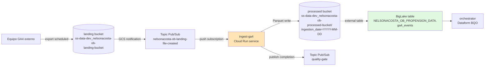
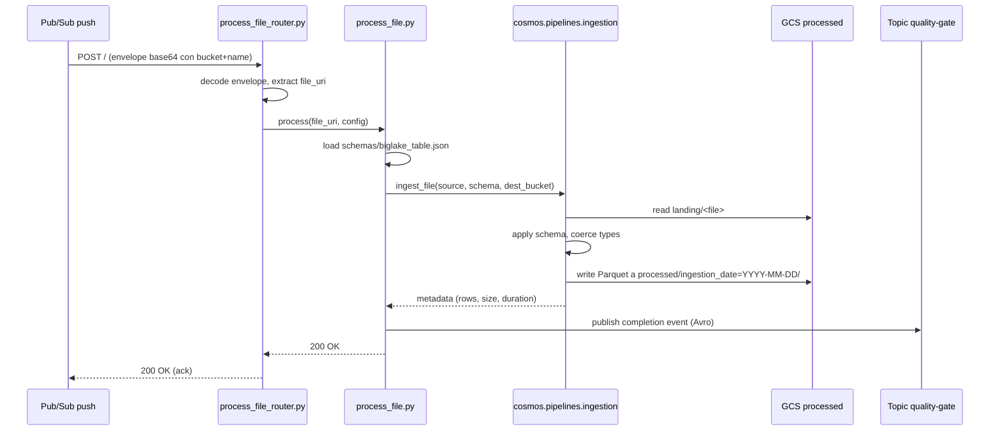

# 05 · ingest-ga4 — Cloud Run service que ingesta GA4 a BigLake

> Primer eslabón real de datos de la cadena. Recibe eventos Pub/Sub cuando cae un archivo GA4 al bucket landing, lo transforma a Parquet aplicando el schema canónico, y lo escribe particionado por fecha al bucket processed. BigLake lee ese bucket desde BigQuery.

## Índice

- [Contexto de negocio](#contexto-de-negocio)
- [Arquitectura del repo](#arquitectura-del-repo)
- [Diagramas](#diagramas)
- [Setup local (Dell LATAM)](#setup-local-dell-latam)
- [Flujo de trabajo](#flujo-de-trabajo)
- [Actividad real en `develop`](#actividad-real-en-develop)
- [Pitfalls vividos](#pitfalls-vividos)
- [Datos y ejecución operativa](#datos-y-ejecución-operativa)
- [Checklist de entrega](#checklist-de-entrega)
- [Referencias cruzadas](#referencias-cruzadas)

---

## Contexto de negocio

Google Analytics 4 (GA4) exporta eventos crudos a un bucket GCS de LATAM (fuera del scope Booster). Un data engineer de otro equipo dispara periódicamente exports que caen como archivos JSON/CSV en el **landing bucket** del namespace Booster (`ss-data-dev_nelsonacosta-ob-landing-bucket`).

`ingest-ga4` es el servicio que reacciona a esos archivos:

1. Se despliega como **Cloud Run service** (con endpoint HTTP, no job).
2. GCS notifica a un topic Pub/Sub cuando cae un objeto nuevo en `landing/`.
3. Ese topic tiene una **push subscription** apuntada al endpoint del servicio.
4. El servicio recibe el POST, lee el archivo del landing, aplica el schema BigLake (100 columnas GA4), lo escribe como Parquet particionado por `ingestion_date=YYYY-MM-DD` al processed bucket, y publica un mensaje al topic `quality-gate` (para observabilidad downstream).
5. BigLake tiene una tabla externa sobre `gs://.../processed/` → los datos son consultables por SQL sin ETL adicional.

Por qué Cloud Run service y no Job: el patrón LATAM para ingestas "event-driven" es push-subscription. Un job requeriría scheduler + polling. El service escala a 0 cuando no hay eventos y a N instancias en paralelo cuando llegan varios archivos juntos.

---

## Arquitectura del repo

```
nelsonacosta-ob-ingest-ga4/
├── nelsonacosta_ob_ingest_ga4/
│   ├── __init__.py
│   ├── __main__.py                    # Uvicorn/gunicorn entry point (FastAPI app)
│   ├── process_file.py                # lógica principal: landing → Parquet → processed
│   ├── routes/
│   │   └── process_file_router.py     # endpoint POST / que decodifica el Pub/Sub push
│   └── utils/
│       └── config.py                  # carga profiles/*.yaml vía cosmos.core
├── schemas/
│   ├── biglake_table.json             # schema de 100 columnas GA4 (usado por Terraform)
│   └── completion_topic_schema.avsc   # Avro del topic quality-gate
├── profiles/
│   ├── application.yaml
│   ├── application-dev.yaml           # project: ss-data-dev
│   ├── application-prod.yaml
│   └── application-test.yaml
├── terraform/
│   ├── config.tf                      # backend GCS state
│   ├── main.tf                        # topics Pub/Sub + subscriptions + SA extra
│   ├── custom_infrastructure.tf       # (nota: nombre con espacio inicial, ver Pitfall G3)
│   ├── variables.tf
│   └── terraform.tfvars
├── tests/
│   ├── conftest.py
│   ├── test_base.py
│   ├── test_process_file.py
│   └── test_process_file_router.py
├── openapi.yaml                       # define POST / (Pub/Sub push envelope)
├── Dockerfile                         # gunicorn + uvicorn worker
├── Makefile
├── pyproject.toml
├── .gitlab-ci.yml                     # include cloud-run-service-pipeline.yml
├── catalog-info.yaml                  # Backstage: type openapi, provides API
├── mkdocs.yaml
├── rc.json
└── .version
```

Puntos clave del diseño:

- **Servicio, no job**: expone HTTP en `/`. El Pub/Sub push le postea el JSON envelope con el objeto GCS (`bucket` + `name`).
- **La lógica pesada vive en `cosmos-pipelines`**: `process_file.py` sólo importa `ingest_file` de `cosmos.pipelines.ingestion` y le pasa el path, schema, y destination bucket. Cosmos hace el parsing + coerción de tipos + Parquet write.
- **Schema BigLake vive junto al código**: `schemas/biglake_table.json` se usa en runtime (aplicar tipos al Parquet) **y** desde Terraform (crear la tabla BigLake). Punto de sincronización crítico — si cambia, corrés `terraform apply` sí o sí.
- **Topic `quality-gate` para observabilidad**: cada ingesta exitosa/fallida publica un evento con schema Avro. El equipo de Governance de LATAM consume ese topic para métricas.

---

## Diagramas

### Diagrama 1: Cadena event-driven



### Diagrama 2: Flujo interno del handler HTTP



### Diagrama 3: Ciclo de dev en `develop`

```mermaid
gitGraph
    commit id: "[COSMOS] Initial commit"
    branch feature/schema
    commit id: "feat(schema): biglake_table + grant"
    checkout develop
    merge feature/schema tag: "MR #1"
    branch fix/landing-bucket-iam-real-name
    commit id: "fix: gcs_bucket_iam module"
    checkout develop
    merge fix/landing-bucket-iam-real-name tag: "MR #2"
```

---

## Setup local (Dell LATAM)

Prerequisitos globales cubiertos en [02-prerequisitos-globales.md](../02-prerequisitos-globales.md). Específico para este repo:

```powershell
# 1. Clonar
git clone https://gitlab.com/latamairlines/data/shared-services/cross/nelsonacosta-ob/nelsonacosta-ob-ingest-ga4.git
cd nelsonacosta-ob-ingest-ga4
git checkout develop

# 2. Venv + deps (repo usa Makefile Linux; en Dell usar PowerShell equivalentes)
python -m venv .venv
.\.venv\Scripts\activate
python -m pip install --upgrade pip setuptools
pip install -r requirements.txt -r requirements-dev.txt -r requirements-test.txt

# 3. Auth GCP
gcloud auth login
gcloud auth application-default login
gcloud config set project ss-data-dev

# 4. Verificar buckets + topic
gsutil ls gs://ss-data-dev_nelsonacosta-ob-landing-bucket/
gsutil ls gs://ss-data-dev_nelsonacosta-ob-processed-bucket/
gcloud pubsub topics list --project ss-data-dev | Select-String nelsonacosta-ob
```

Ejecución local del service (para pruebas con envelope simulado):

```powershell
$env:APP_ENVIRONMENT = "local"
$env:PORT = "8080"
python -m nelsonacosta_ob_ingest_ga4

# En otra terminal, simular un Pub/Sub push:
$envelope = @{
  message = @{
    data = [Convert]::ToBase64String([Text.Encoding]::UTF8.GetBytes('{"bucket":"ss-data-dev_nelsonacosta-ob-landing-bucket","name":"ga4/events_20260731.json"}'))
    messageId = "test-123"
  }
  subscription = "projects/ss-data-dev/subscriptions/test"
} | ConvertTo-Json -Depth 5

Invoke-RestMethod -Uri "http://localhost:8080/" -Method Post -Body $envelope -ContentType "application/json"
```

---

## Flujo de trabajo

1. **Branch desde `develop`**

   ```powershell
   git checkout develop
   git pull --rebase
   git checkout -b feature/mi-cambio
   ```

2. **Cambios típicos**:
   - Modificar `schemas/biglake_table.json` (agregar/quitar columnas GA4).
   - Ajustar `process_file.py` (validaciones adicionales, logging).
   - Nuevo profile en `profiles/`.
   - Cambios de infra en `terraform/*.tf` (topics, subscriptions, IAM).

3. **Test local**

   ```powershell
   pytest tests/ -v --cov=nelsonacosta_ob_ingest_ga4 --cov-fail-under=65
   ruff check nelsonacosta_ob_ingest_ga4 tests
   ```

4. **Terraform plan (si tocaste `terraform/`)**

   ```powershell
   cd terraform
   terraform init -backend-config="bucket=ss-data-dev-tf-state"
   terraform plan -var-file=terraform.tfvars
   cd ..
   ```

5. **Commit + push**

   ```powershell
   git add -A
   git commit -m "feat: descripción"
   git push origin feature/mi-cambio
   ```

6. **MR** contra `develop`. Reviewer `<REVIEWER_NEURALWORKS>` aprueba; merge por UI.

7. **CI verde** → despliega Cloud Run service en `ss-data-dev`. Si tocaste Terraform, también aplica infra.

8. **Verificación post-deploy**:

   ```powershell
   # Endpoint desplegado
   gcloud run services describe nelsonacosta-ob-ingest-ga4 --region us-east1 --project ss-data-dev --format "value(status.url)"

   # Probar con un archivo real del landing (dispara Pub/Sub → service)
   gsutil cp ./sample_ga4.json gs://ss-data-dev_nelsonacosta-ob-landing-bucket/ga4/sample_ga4.json

   # Ver logs del service
   gcloud logging read 'resource.type=cloud_run_revision AND resource.labels.service_name=nelsonacosta-ob-ingest-ga4' --project ss-data-dev --limit 30
   ```

---

## Actividad real en `develop`

| Métrica                    | Valor                                            |
|----------------------------|--------------------------------------------------|
| Rango de fechas            | 2026-07-17 → 2026-07-20                          |
| Commits totales            | 5 (2 merges de MR + 2 de branches + initial)     |
| Merge Requests             | 2 (`feature/schema`, `fix/landing-bucket-iam-real-name`) |
| Archivos tocados           | `schemas/biglake_table.json`, `terraform/main.tf`, `terraform/ custom_infrastructure.tf` |
| Cobertura test             | 65% (mínimo forzado por CI)                      |
| LOC efectivas Python       | ~90 (routers + process + config)                 |

Historial condensado:

| Fecha       | Commit    | MR                                | Foco                                          |
|-------------|-----------|-----------------------------------|-----------------------------------------------|
| 17-jul-2026 | `12acf43` | `feature/schema`                  | Schema BigLake (100 cols GA4) + grant landing bucket |
| 20-jul-2026 | `9037088` | `fix/landing-bucket-iam-real-name`| IAM landing bucket con módulo Cosmos `gcs_bucket_iam` |

---

## Pitfalls vividos

### Pitfall G1 — Schema BigLake desincronizado entre runtime y Terraform (17-jul-2026)

**Síntoma**: `terraform apply` OK, servicio deployado OK, pero al ingestar un archivo el Parquet resultante tenía tipos distintos a los que BigLake esperaba → queries BQ devolvían `Field 'event_timestamp' has unexpected type: expected INT64, got STRING`.

**Causa**: el schema vive en `schemas/biglake_table.json` y se lee desde **dos lados**:
1. **Terraform** (`terraform/main.tf`) lo usa para crear la tabla externa BigLake.
2. **Runtime Python** (`process_file.py`) lo usa para aplicar tipos al Parquet.

Si actualizás el JSON pero **sólo se despliega el service** (sin `terraform apply`), BigLake se queda con el schema viejo y hay mismatch.

**Solución**:

```powershell
# Regla: cambio en schemas/biglake_table.json SIEMPRE requiere terraform apply
cd terraform
terraform init -backend-config="bucket=ss-data-dev-tf-state"
terraform apply -var-file=terraform.tfvars
```

**Regla operacional**: al abrir MR que toca `schemas/biglake_table.json`, en la descripción marcar explícitamente `[REQUIRE TERRAFORM APPLY]` para que el reviewer verifique que el pipeline de infra corrió.

---

### Pitfall G2 — IAM landing bucket con nombre custom (20-jul-2026)

**Síntoma**: al desplegar por primera vez, el service posteaba `403 Forbidden: does not have storage.objects.get access` sobre el landing bucket.

**Causa**: el bucket landing NO se crea en el Terraform de este repo — lo crea `nelsonacosta-ob-infraestructure`. El IAM binding para dar `roles/storage.objectViewer` al SA de este service estaba usando un `google_storage_bucket_iam_member` directo, pero el nombre del bucket tenía un formato custom (`ss-data-dev_nelsonacosta-ob-landing-bucket` con guion bajo separador de project + guiones separador de partes) que hacía frágil el binding.

**Solución** (`MR #2` — `fix/landing-bucket-iam-real-name`):

```hcl
# terraform/main.tf
# NO: google_storage_bucket_iam_member directo con string interpolation
# SÍ: usar el módulo Cosmos que resuelve el nombre real
module "landing_bucket_iam" {
  source        = "cosmos-latam/gcs_bucket_iam"
  bucket_name   = "ss-data-dev_nelsonacosta-ob-landing-bucket"
  role          = "roles/storage.objectViewer"
  members       = ["serviceAccount:${google_service_account.ingest_ga4.email}"]
}
```

**Regla**: para buckets creados fuera de este repo, siempre usar el módulo Cosmos `gcs_bucket_iam` — resuelve el nombre exacto y valida existencia en plan-time.

---

### Pitfall G3 — Archivo Terraform con espacio en el nombre (17-jul-2026)

**Síntoma**: en Windows PowerShell `terraform fmt` fallaba con "path not found" ocasionalmente.

**Causa**: el scaffold Cosmos generó `terraform/ custom_infrastructure.tf` con un espacio inicial en el nombre (bug del template). Terraform lo acepta pero herramientas de linting Windows-side lo bailan.

**Solución** (workaround, no fix definitivo):

```powershell
# Si terraform fmt falla, invocar con path escapado:
terraform fmt -recursive '.\terraform\'
# O renombrar (requiere MR aparte para no romper histórico):
# Renaming pendiente hasta consensuar con equipo template.
```

**Regla**: no renombrar archivos del scaffold sin coordinar con el equipo `cosmos-template-cloud-run`. Documentar el issue y seguir.

---

### Pitfall G4 — Pub/Sub push subscription sin dead letter queue

**Síntoma** (potencial, no vivido en dev pero documentado en review): si el service devuelve 5xx repetidamente, Pub/Sub re-encola indefinidamente → loop infinito consumiendo el archivo GA4.

**Causa**: la subscription creada por Terraform no tiene `dead_letter_policy` configurada.

**Solución** (recomendación de review, aplicar en próximo MR):

```hcl
# terraform/main.tf — agregar al recurso google_pubsub_subscription
dead_letter_policy {
  dead_letter_topic     = google_pubsub_topic.dlq.id
  max_delivery_attempts = 5
}
```

**Regla**: toda push subscription en producción debe tener DLQ. Sin excepciones.

---

### Pitfall G5 — Escalado del service en spikes de ingesta

**Síntoma** (documentado en review, no vivido aún): cuando GA4 exporta N archivos juntos, Pub/Sub genera N mensajes casi simultáneos → Cloud Run escala a `max_instances` y algunos archivos quedan encolados.

**Causa**: `max_instances` default del scaffold es bajo (típicamente 5). Para ingestas batch de GA4 puede ser insuficiente.

**Solución**: subir el techo en el YAML de deploy del service (via Cosmos template overrides) según el volumen esperado. En dev quedó en 10; para prod evaluar según carga real.

**Regla**: no dejar `max_instances` en el default del scaffold para servicios event-driven de ingesta.

---

## Datos y ejecución operativa

### Artefactos SQL / Schema (copias sanitizadas en este repo)

| Archivo                                | Origen (GitLab)                            | Placeholders | Notas                        |
|----------------------------------------|--------------------------------------------|--------------|------------------------------|
| [`biglake_table.json`](../assets/dataform/ingest-ga4/biglake_table.json) | `schemas/biglake_table.json`               | ninguno      | Schema plano 100 cols GA4    |
| [`completion_topic_schema.avsc`](../assets/dataform/ingest-ga4/completion_topic_schema.avsc) | `schemas/completion_topic_schema.avsc`     | ninguno      | Avro del topic quality-gate  |

**Nota**: este repo no tiene SQL. La transformación es Parquet-first (schema application + coerción de tipos vía `cosmos.pipelines.ingestion`). Las queries que consumen la BigLake table viven en `orchestrator` (Dataform BQO).

Fuente autoritativa (rama `develop`):
`https://gitlab.com/latamairlines/data/shared-services/cross/nelsonacosta-ob/nelsonacosta-ob-ingest-ga4/-/tree/develop/schemas`

### Comandos operativos Dell (PowerShell)

**Simular una ingesta real subiendo un archivo GA4 al landing:**

```powershell
gsutil cp .\ga4_sample_20260731.json gs://ss-data-dev_nelsonacosta-ob-landing-bucket/ga4/ga4_sample_20260731.json
```

**Ver logs del service en tiempo real:**

```powershell
gcloud logging tail 'resource.type=cloud_run_revision AND resource.labels.service_name=nelsonacosta-ob-ingest-ga4' `
  --project ss-data-dev
```

**Ver metricas de la subscription (backlog):**

```powershell
gcloud pubsub subscriptions describe nelsonacosta-ob-landing-file-created-sub `
  --project ss-data-dev `
  --format "value(name,ackDeadlineSeconds,messageRetentionDuration)"

# Backlog actual (num_undelivered_messages)
gcloud monitoring time-series list `
  --project ss-data-dev `
  --filter='metric.type="pubsub.googleapis.com/subscription/num_undelivered_messages" AND resource.labels.subscription_id="nelsonacosta-ob-landing-file-created-sub"' `
  --interval-end-time=(Get-Date -Format o) `
  --interval-start-time=((Get-Date).AddMinutes(-15) | Get-Date -Format o) 2>&1 | Select-Object -First 30
```

**Forzar re-procesamiento de un archivo específico:**

```powershell
# Opción A: re-subir el archivo (dispara notification)
gsutil cp gs://ss-data-dev_nelsonacosta-ob-landing-bucket/ga4/archivo.json .\tmp.json
gsutil cp .\tmp.json gs://ss-data-dev_nelsonacosta-ob-landing-bucket/ga4/archivo.json

# Opción B: postear directo al service (requiere token de identidad)
$token = gcloud auth print-identity-token
$serviceUrl = gcloud run services describe nelsonacosta-ob-ingest-ga4 --region us-east1 --project ss-data-dev --format "value(status.url)"
Invoke-RestMethod -Uri $serviceUrl -Method Post `
  -Headers @{ Authorization = "Bearer $token" } `
  -ContentType "application/json" `
  -Body '{"message":{"data":"eyJidWNrZXQiOiJzcy1kYXRhLWRldl9uZWxzb25hY29zdGEtb2ItbGFuZGluZy1idWNrZXQiLCJuYW1lIjoiZ2E0L2FyY2hpdm8uanNvbiJ9"},"subscription":"manual"}'
```

### Queries de verificación (bq)

**Confirmar que la BigLake table está poblada con la partición del día:**

```bash
bq query --project_id=ss-data-dev --nouse_legacy_sql "
  SELECT
    ingestion_date,
    COUNT(*) AS rows,
    COUNT(DISTINCT user_pseudo_id) AS unique_users
  FROM \`ss-data-dev.NELSONACOSTA_OB_PROPENSION_DATA.ga4_events\`
  WHERE ingestion_date >= DATE_SUB(CURRENT_DATE(), INTERVAL 7 DAY)
  GROUP BY ingestion_date
  ORDER BY ingestion_date DESC
"
```

**Verificar particiones en GCS coinciden con lo que ve BigLake:**

```powershell
gsutil ls gs://ss-data-dev_nelsonacosta-ob-processed-bucket/ | Select-Object -First 10
```

**Chequear que no haya archivos huérfanos en landing (procesados pero no borrados):**

```powershell
gsutil ls -l gs://ss-data-dev_nelsonacosta-ob-landing-bucket/ga4/ | Select-Object -First 20
```

### Rollback / re-ejecución

**Rollback del service a revisión anterior:**

```powershell
# Listar revisiones
gcloud run revisions list --service nelsonacosta-ob-ingest-ga4 --region us-east1 --project ss-data-dev --limit 10

# Dirigir 100% del tráfico a una revisión previa
gcloud run services update-traffic nelsonacosta-ob-ingest-ga4 `
  --to-revisions <REVISION_NAME>=100 `
  --region us-east1 `
  --project ss-data-dev
```

**Rollback del schema BigLake (si un cambio rompió consultas downstream):**

```powershell
# 1. Revertir el JSON al commit previo
git checkout <SHA_PREVIO> -- schemas/biglake_table.json

# 2. terraform apply para recrear la tabla externa con el schema viejo
cd terraform
terraform apply -var-file=terraform.tfvars
```

**Purgar la subscription (drenar backlog acumulado):**

```powershell
gcloud pubsub subscriptions seek nelsonacosta-ob-landing-file-created-sub `
  --time=(Get-Date -Format o) `
  --project ss-data-dev
```

---

## Checklist de entrega

- [ ] Branch `feature/*` o `fix/*` creada desde `develop` actualizado
- [ ] Si tocó `schemas/biglake_table.json`, MR marcado `[REQUIRE TERRAFORM APPLY]`
- [ ] Si tocó `terraform/`, `terraform plan` local sin diffs inesperados
- [ ] `pytest --cov-fail-under=65` verde
- [ ] `ruff check` sin errores
- [ ] Prueba local con envelope Pub/Sub simulado funciona (200 OK + archivo en processed)
- [ ] Commit + push a la branch
- [ ] MR abierto contra `develop` con descripción clara + link al ticket
- [ ] Reviewer `<REVIEWER_NEURALWORKS>` aprobó
- [ ] Merge por UI (no vía API)
- [ ] CI verde en `develop`
- [ ] Terraform pipeline aplicó cambios de infra (si aplica)
- [ ] Cloud Run service desplegado (verificar `gcloud run services describe`)
- [ ] Subir un archivo test al landing dispara ingesta → aparece en processed
- [ ] Query BQ sobre `ga4_events` devuelve la partición del día

---

## Referencias cruzadas

- [00-README](../00-README.md) · índice del playbook
- [01-glossary](../01-glossary.md) · BigLake, Cloud Run service, push subscription
- [02-prerequisitos-globales](../02-prerequisitos-globales.md) · gcloud, gsutil, terraform, PowerShell
- [Playbook 01 · infraestructure](./01-infraestructure.md) · crea landing/processed buckets + tabla BigLake
- [Playbook 02 · orchestrator](./02-orchestrator.md) · Dataform corre sobre `ga4_events` (poblada por este service)
- [Playbook 03 · ml-propension](./03-ml-propension.md) · consume master table de orchestrator
- [Playbook 04 · data-to-bucket](./04-data-to-bucket.md) · exporta predictions a Light RAG
- Playbook 06 · chatbot-ob (pendiente) · consume Light RAG data

**Fuente autoritativa GitLab (rama `develop`):**
`https://gitlab.com/latamairlines/data/shared-services/cross/nelsonacosta-ob/nelsonacosta-ob-ingest-ga4/-/tree/develop`
