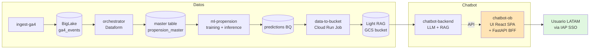
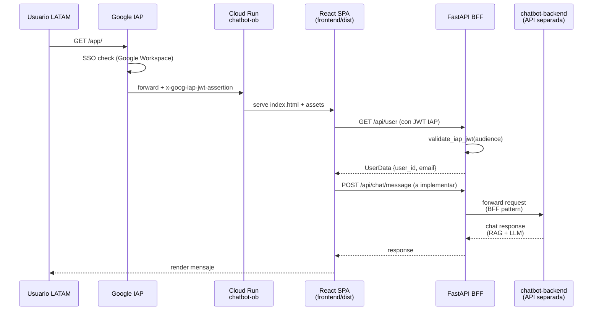
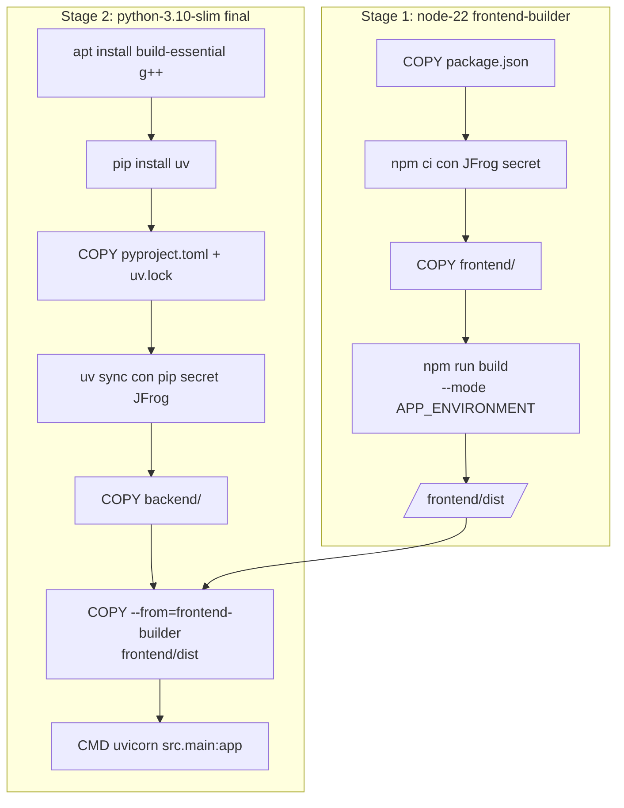

# 06 · chatbot-ob — Cloud Run full-stack (React + FastAPI + IAP)

> Última pieza de la cadena end-to-end: la UI que consume el chatbot. Cloud Run service que sirve un React SPA y un backend FastAPI liviano detrás de IAP (Identity-Aware Proxy) de Google. En el snapshot documentado el repo está **como scaffold puro** — todavía no wireado con el backend LLM ni con el Light RAG. Este playbook cubre qué trae el template Cosmos full-stack y cómo levantarlo antes de conectarlo al chatbot real.

## Índice

- [Contexto de negocio](#contexto-de-negocio)
- [Arquitectura del repo](#arquitectura-del-repo)
- [Diagramas](#diagramas)
- [Setup local (Dell LATAM)](#setup-local-dell-latam)
- [Flujo de trabajo](#flujo-de-trabajo)
- [Actividad real en `develop`](#actividad-real-en-develop)
- [Pitfalls vividos](#pitfalls-vividos)
- [Datos y ejecución operativa](#datos-y-ejecución-operativa)
- [Checklist de entrega](#checklist-de-entrega)
- [Referencias cruzadas](#referencias-cruzadas)

---

## Contexto de negocio

El caso de uso del namespace Booster es un **chatbot de propensión de compra**: dado un usuario identificado (por IAP), el chatbot responde preguntas sobre datos de propensión y sugerencias comerciales. La cadena de datos ya está construida por los 5 repos anteriores:

1. `ingest-ga4` puebla la BigLake table con eventos GA4.
2. `orchestrator` (Dataform) construye la master table de propensión.
3. `ml-propension` entrena/infiere y escribe predictions.
4. `data-to-bucket` exporta predictions a un GCS bucket con formato Light RAG.
5. `chatbot-backend` (repo hermano, fuera de estos 6) es el backend LLM que consume el Light RAG.
6. **`chatbot-ob` (este repo)** es la **UI web** que el usuario final abre — un React SPA servido por Cloud Run detrás de IAP, con un FastAPI thin que hace de BFF (Backend For Frontend).

Por qué IAP: cualquier corp user LATAM con Google Workspace puede autenticarse por SSO. El backend valida el JWT `x-goog-iap-jwt-assertion` que IAP inyecta en cada request. Sin cuenta LATAM Google Workspace, no entrás.

**Estado actual del repo (snapshot 31-jul-2026)**: sólo el scaffold Cosmos, sin lógica de chatbot. Un solo commit en `develop` (`[COSMOS] Initial commit`). Este playbook documenta lo que el template trae + los puntos de extensión donde hay que conectar el `chatbot-backend`.

---

## Arquitectura del repo

```
nelsonacosta-ob-chatbot-ob/
├── backend/
│   ├── src/
│   │   ├── main.py                    # FastAPI app: /health, /api/user, /api/ping + mount SPA
│   │   ├── front.py                   # sirve frontend/dist como static + SPA catch-all
│   │   └── shared/
│   │       ├── auth.py                # validación JWT IAP (x-goog-iap-jwt-assertion)
│   │       ├── schema.py              # UserData Pydantic model
│   │       └── properties.py          # loader profiles/*.yaml (Cosmos)
│   ├── profiles/
│   │   ├── application.yaml           # config compartida
│   │   ├── application-dev.yaml
│   │   ├── application-prod.yaml
│   │   └── application-local.yaml     # bypass IAP en local
│   └── pyproject.toml                 # fastapi, cosmos-core, cosmos-gcp, google-auth, pyjwt
├── frontend/
│   ├── src/
│   │   ├── main.tsx                   # React root: UserProvider > ThemeProvider > Router
│   │   ├── AppLayout.tsx              # Layout con header + footer Cosmos
│   │   ├── pages/                     # HomePage, AboutPage, ContactPage, NotFound
│   │   ├── features/
│   │   │   ├── auth/context/UserContext.tsx    # fetch /api/user + provee al árbol
│   │   │   ├── contact/components/ContactForm.tsx
│   │   │   └── healthCheck/components/BackendHealthCheck.tsx
│   │   ├── shared/
│   │   │   ├── components/AppHeader.tsx, Welcome.tsx
│   │   │   ├── hooks/useValidContext.ts
│   │   │   └── utils/redirectToApp.tsx
│   │   └── assets/fonts/              # Latam_Sans (10 pesos)
│   ├── profiles/
│   │   ├── .env                       # PUBLIC_API_PREFIX, PUBLIC_APP_PREFIX
│   │   ├── .env.dev, .env.prod
│   │   └── .env.local.example
│   ├── package.json                   # React 19, react-router 7, @cosmos/design-components, tailwind v4
│   ├── vite.config.ts                 # proxy /api → backend:8080 en dev
│   └── eslint.config.js
├── docs/                              # dev.md + index.md (mkdocs)
├── .claude/skills/                    # (queda en repo, es del scaffold — no se usa desde Boosters)
├── Dockerfile                         # multi-stage: node build → python runtime
├── .gitlab-ci.yml                     # include cloud-run-pipeline.yml (enable_iap: true)
├── catalog-info.yaml                  # Backstage: type website
├── Makefile                           # make install / make run front / make run back
├── jfrog_npm.sh                       # auth JFrog para @cosmos/design-components
└── mkdocs.yaml
```

Piezas clave:

- **`Dockerfile` multi-stage**: primer stage compila el frontend con `npm ci && npm run build` a `frontend/dist`. Segundo stage instala backend Python con `uv sync` y copia el `frontend/dist` al filesystem del container. Un solo container sirve todo.
- **FastAPI monta el SPA**: `backend/src/front.py` sirve `frontend/dist/index.html` como catch-all — cualquier ruta no matcheada por `/api/*` o `/health` devuelve el `index.html` para que React Router tome control.
- **IAP JWT validation**: `backend/src/shared/auth.py` valida el header `x-goog-iap-jwt-assertion` contra `iap-audience` (definido en `profiles/*.yaml`). En local no hay IAP → el auth flow es distinto (bypass o mock, según `APP_ENVIRONMENT`).
- **JFrog para `@cosmos/design-components`**: los componentes UI de Cosmos son npm privados en Artifactory LATAM. `jfrog_npm.sh` configura `.npmrc` con las credenciales.

---

## Diagramas

### Diagrama 1: Cadena end-to-end completa (los 6 repos)



### Diagrama 2: Runtime del container Cloud Run



### Diagrama 3: Multi-stage Docker build



---

## Setup local (Dell LATAM)

```powershell
# 1. Clonar
git clone https://gitlab.com/latamairlines/data/shared-services/cross/nelsonacosta-ob/nelsonacosta-ob-chatbot-ob.git
cd nelsonacosta-ob-chatbot-ob
git checkout develop

# 2. Auth JFrog para @cosmos/design-components
# La API key JFrog está en el portal de developers de LATAM (self-service).
# El script jfrog_npm.sh genera un .npmrc con la credencial.
bash jfrog_npm.sh   # (o correr sus comandos manualmente si estás en PowerShell puro)

# 3. Install UV (si no está)
irm https://astral.sh/uv/install.ps1 | iex

# 4. Install dependencies backend + frontend
make install
# Equivale a:
#   cd backend && uv sync
#   cd frontend && npm ci

# 5. Copiar env local
cp frontend/profiles/.env.local.example frontend/profiles/.env.local

# 6. Auth GCP (para el backend que llama BQ/Firestore si en el futuro se agrega)
gcloud auth application-default login
```

Correr en dos terminales:

```powershell
# Terminal 1 — backend FastAPI en :8080
make run back
# Equivale a: cd backend && uv run uvicorn src.main:app --reload --port 8080

# Terminal 2 — frontend Vite en :5173
make run front
# Equivale a: cd frontend && npm run dev
```

Abrí `http://localhost:5173/`. El proxy Vite reenvía `/api/*` al backend `:8080`.

**Bypass IAP en local**: con `APP_ENVIRONMENT=local`, `backend/src/shared/auth.py` no fuerza JWT — devuelve un user mockeado (o el user de `gcloud auth list`, según el snippet en `get_user_data_from_iap_request`). Confirmar con el equipo el patrón exacto que se decida usar al conectar el `chatbot-backend`.

---

## Flujo de trabajo

1. **Branch desde `develop`**

   ```powershell
   git checkout develop
   git pull --rebase
   git checkout -b feature/mi-cambio
   ```

2. **Puntos de extensión típicos** (cuando se conecte al `chatbot-backend`):
   - Nueva ruta `/api/chat/message` en `backend/src/main.py` que proxee al `chatbot-backend`.
   - Feature nueva en `frontend/src/features/chat/` con componente `ChatBox.tsx` + hook `useChat.ts`.
   - Config del endpoint del `chatbot-backend` en `backend/profiles/application-*.yaml`.
   - Feature toggle vía `PUBLIC_*` env var en `frontend/profiles/.env.*`.

3. **Lint local**

   ```powershell
   cd backend
   uv run ruff check src
   uv run mypy src

   cd ../frontend
   npm run lint
   ```

4. **Build local del frontend + verificar que el backend lo sirve**

   ```powershell
   cd frontend
   npm run build   # genera frontend/dist
   cd ../backend
   uv run uvicorn src.main:app --port 8080
   # Abrir http://localhost:8080/  → debe servir el index.html buildeado (no dev server)
   ```

5. **Docker build local (opcional, útil para debug de la imagen)**

   ```powershell
   docker build `
     --secret id=npm-secret,src=$env:USERPROFILE/.npmrc `
     --secret id=pip-secret,src=$env:USERPROFILE/.pip/pip.conf `
     --build-arg APP_ENVIRONMENT=local `
     -t chatbot-ob:local .

   docker run -p 8080:8080 -e APP_ENVIRONMENT=local chatbot-ob:local
   ```

6. **Commit + push + MR** contra `develop`. Reviewer `<REVIEWER_NEURALWORKS>` aprueba; merge por UI.

7. **CI verde** → despliega Cloud Run service en `ss-data-dev`. El pipeline `cloud-run-pipeline.yml` habilita IAP automáticamente porque el YAML dice `enable_iap: true`.

8. **Verificación post-deploy**:

   ```powershell
   # URL del servicio
   $url = gcloud run services describe nelsonacosta-ob-chatbot-ob --region us-east1 --project ss-data-dev --format "value(status.url)"
   Write-Output $url

   # Debe redirigir a login IAP (HTTP 302 a accounts.google.com)
   curl -I $url

   # Con token de identidad puede consumir el /health directamente
   $token = gcloud auth print-identity-token
   curl -H "Authorization: Bearer $token" "$url/health"
   ```

---

## Actividad real en `develop`

| Métrica              | Valor                                    |
|----------------------|------------------------------------------|
| Rango de fechas      | 2026-07-23 → 2026-07-23                  |
| Commits totales      | 1 (scaffold Cosmos inicial)              |
| Merge Requests       | 0                                        |
| Archivos tocados     | 81 (todos del scaffold, ninguno modificado post-init) |
| Cobertura test       | N/A (no hay tests todavía)               |
| LOC efectivas propias| 0 (todo scaffold)                        |

Historial condensado:

| Fecha       | Commit    | MR   | Foco                                    |
|-------------|-----------|------|-----------------------------------------|
| 23-jul-2026 | `363edfb` | —    | `[COSMOS] Initial commit` — scaffold full-stack template |

**Nota importante**: el repo se dejó como scaffold porque la cadena de datos (repos 01-05) era la prioridad del hands-on. La integración chatbot-backend ↔ chatbot-ob es el siguiente hito, fuera del scope del snapshot 31-jul-2026 de este playbook.

---

## Pitfalls vividos

### Pitfall C1 — Scaffold JFrog auth necesario antes del primer install (23-jul-2026)

**Síntoma**: `make install` fallaba con `npm ERR! 401 Unauthorized - @cosmos/design-components`.

**Causa**: el paquete `@cosmos/design-components` vive en el Artifactory de LATAM (`artifactoryrepo1.appslatam.com`) — no en npmjs.org público. Sin `.npmrc` configurado con la API key JFrog personal, npm no puede resolverlo.

**Solución**:

```powershell
# 1. Ir al portal de developers LATAM → "JFrog credentials" → generar API key personal
# 2. Correr jfrog_npm.sh (o su equivalente PowerShell):
#    Escribe ~/.npmrc con la URL del registry Cosmos + api key
bash jfrog_npm.sh

# Verificar:
Get-Content $env:USERPROFILE/.npmrc
# Debe contener:
#   @cosmos:registry=https://artifactoryrepo1.appslatam.com/artifactory/api/npm/cosmos-npm/
#   //artifactoryrepo1.appslatam.com/...:_authToken=<TOKEN>
```

**Regla**: la API key JFrog es personal y no se comitea. En CI está inyectada vía `--secret id=npm-secret` en el Docker build.

---

### Pitfall C2 — Confusion `backend/src/` vs `backend/app/` en Dockerfile (23-jul-2026)

**Síntoma**: `docker build` local funcionaba, pero al correr el container aparecía `ModuleNotFoundError: No module named 'src'`.

**Causa**: el `Dockerfile` de línea original tenía `RUN mkdir -p backend/app profiles` (heredado de un scaffold anterior de Cosmos) pero el código real vive en `backend/src/`. El comando `CMD ["uv", "run", "--directory", "backend", "uvicorn", "src.main:app", ...]` apunta a `src`. Ambos convivían y funcionaban en local por casualidad (había un `src` y un `app` vacío).

**Solución**: mantener consistencia con `src/`. Si se agrega lógica nueva, va en `backend/src/`, no `backend/app/`. El `mkdir -p backend/app` en el Dockerfile es inofensivo pero engañoso — se puede limpiar en un MR de housekeeping.

```dockerfile
# Dockerfile (limpieza opcional)
# ANTES: RUN mkdir -p backend/app profiles
# DESPUÉS: RUN mkdir -p backend/src profiles
```

**Regla**: `backend/src/` es la convención de este scaffold. No usar `backend/app/`.

---

### Pitfall C3 — Frontend build sin `--mode` produce env vars incorrectas (23-jul-2026)

**Síntoma** (detectado en review, no vivido en runtime porque el scaffold nunca llegó a prod): al buildear con `npm run build` sin flag `--mode`, Vite usaba `frontend/profiles/.env` (default) en vez de `.env.dev` o `.env.prod`.

**Causa**: `vite.config.ts` tiene `envDir: "./profiles"` pero Vite decide qué archivo `.env.*` cargar según `--mode`. Sin el flag, carga `.env` genérico.

**Solución**: siempre pasar `--mode` al build.

```powershell
# Frontend local build para dev:
npm run build -- --mode dev

# En el Dockerfile ya está bien:
#   RUN npm run build -- --mode $APP_ENVIRONMENT
# Sólo asegurar que APP_ENVIRONMENT esté seteado en el build-arg del docker build.
```

**Regla**: en cualquier `npm run build` local o en CI, siempre `--mode` explícito. El `PUBLIC_APP_PREFIX` cambia entre envs y sin el mode correcto las rutas del router quedan rotas.

---

### Pitfall C4 — IAP audience mal configurado tira 401 en dev (23-jul-2026)

**Síntoma** (documentado en review, no vivido aún): en dev, el frontend recibe 401 al llamar `/api/user` porque `iap-audience` en `profiles/application-dev.yaml` no matchea con el audience real que IAP inyecta.

**Causa**: el `iap-audience` es un string con formato `/projects/<PROJECT_NUMBER>/global/backendServices/<BACKEND_ID>`. Se obtiene con:

```powershell
gcloud compute backend-services describe nelsonacosta-ob-chatbot-ob-backend `
  --global `
  --project ss-data-dev `
  --format "value(id)"
```

Si el YAML tiene el string mal o vacío, `validate_iap_jwt()` tira `HTTPException(401)`.

**Solución**: setear el `iap-audience` correcto en `application-dev.yaml` y `application-prod.yaml` **después del primer deploy** (porque hasta que Cloud Run no exista, no hay backend service ID). El deploy inicial se hace con IAP deshabilitado, se lee el backend ID, se popula el YAML, se re-deploya con IAP.

**Regla**: el audience es post-deploy. Documentarlo en el MR de deploy inicial.

---

### Pitfall C5 — SPA catch-all interfiere con `/api/*` si el orden de mount es incorrecto (23-jul-2026)

**Síntoma** (potencial, no vivido): si `mount_front(app)` se llama antes de `app.include_router(router)`, cualquier request a `/api/*` cae en el `spa_catch_all` de `front.py` y devuelve `index.html` en vez de la respuesta JSON del router.

**Causa**: FastAPI resuelve rutas en orden de registro. Como `spa_catch_all` matchea `/{path:path}` (todo), tiene que registrarse **después** de las rutas específicas.

**Solución**: en `backend/src/main.py`, mantener el orden:

```python
app.include_router(router)   # PRIMERO — /api/* y /health
mount_front(app)             # DESPUÉS — SPA catch-all
```

**Regla**: nunca invertir ese orden. Documentar con comentario `# ORDER MATTERS` si se refactoriza.

---

## Datos y ejecución operativa

### Artefactos SQL / Schema

**No aplica**. Este repo es UI + BFF puro — no hay Dataform, no hay tablas propias, no hay schemas. Cuando se conecte al `chatbot-backend`, este repo será un cliente HTTP de ese backend; no toca datos directamente.

Referencia cruzada para schemas relevantes downstream:
- Master table de propensión: ver [Playbook 02 · orchestrator](./02-orchestrator.md), sección "Datos y ejecución operativa"
- Predictions BQ: ver [Playbook 03 · ml-propension](./03-ml-propension.md), sección "Datos y ejecución operativa"
- Light RAG payloads: ver [Playbook 04 · data-to-bucket](./04-data-to-bucket.md), sección "Datos y ejecución operativa"

### Comandos operativos Dell (PowerShell)

**Verificar el service desplegado:**

```powershell
gcloud run services describe nelsonacosta-ob-chatbot-ob `
  --region us-east1 `
  --project ss-data-dev `
  --format "value(status.url,status.conditions[0].type)"
```

**Ver logs en tiempo real:**

```powershell
gcloud logging tail 'resource.type=cloud_run_revision AND resource.labels.service_name=nelsonacosta-ob-chatbot-ob' `
  --project ss-data-dev
```

**Chequear estado IAP del backend service:**

```powershell
gcloud iap web get-iam-policy `
  --resource-type=backend-services `
  --service=nelsonacosta-ob-chatbot-ob-backend `
  --project=ss-data-dev
```

**Otorgar acceso IAP a un usuario nuevo:**

```powershell
gcloud iap web add-iam-policy-binding `
  --resource-type=backend-services `
  --service=nelsonacosta-ob-chatbot-ob-backend `
  --member="user:<EMAIL>@latam.com" `
  --role="roles/iap.httpsResourceAccessor" `
  --project=ss-data-dev
```

**Probar el `/health` desde línea de comandos con auth IAP:**

```powershell
$token = gcloud auth print-identity-token
$url = gcloud run services describe nelsonacosta-ob-chatbot-ob --region us-east1 --project ss-data-dev --format "value(status.url)"
Invoke-RestMethod -Uri "$url/health" -Headers @{ Authorization = "Bearer $token" }
```

**Obtener el `iap-audience` para poblar `profiles/application-dev.yaml`:**

```powershell
gcloud compute backend-services list --project ss-data-dev --filter "name~nelsonacosta-ob-chatbot-ob" --format "table(name,id)"
# Con project number:
$projectNumber = gcloud projects describe ss-data-dev --format "value(projectNumber)"
$backendId = gcloud compute backend-services describe <backend-service-name> --global --project ss-data-dev --format "value(id)"
$audience = "/projects/$projectNumber/global/backendServices/$backendId"
Write-Output "iap-audience: $audience"
```

### Queries de verificación

**No aplica** — este repo no tiene BigQuery propio.

Para verificar que la cadena end-to-end funciona (datos llegando hasta el UI):
1. Correr las queries del playbook 03 (predictions frescas del día en BQ).
2. Correr las queries del playbook 04 (archivos exportados a Light RAG bucket del día).
3. Curl al `chatbot-backend` (repo hermano) con un prompt de prueba y validar respuesta.
4. Abrir la URL del `chatbot-ob` en el browser corp y validar que el chat carga y responde.

### Rollback / re-ejecución

**Rollback del service a revisión anterior:**

```powershell
# Listar revisiones
gcloud run revisions list --service nelsonacosta-ob-chatbot-ob --region us-east1 --project ss-data-dev --limit 10

# Dirigir 100% del tráfico a una revisión previa
gcloud run services update-traffic nelsonacosta-ob-chatbot-ob `
  --to-revisions <REVISION_NAME>=100 `
  --region us-east1 `
  --project ss-data-dev
```

**Deshabilitar IAP temporalmente (sólo para debug agudo — nunca dejarlo así en prod):**

```powershell
# Desactivar IAP en el backend service (deja el service accesible sin login corp)
gcloud iap web disable `
  --resource-type=backend-services `
  --service=nelsonacosta-ob-chatbot-ob-backend `
  --project=ss-data-dev

# Re-activar
gcloud iap web enable `
  --resource-type=backend-services `
  --service=nelsonacosta-ob-chatbot-ob-backend `
  --project=ss-data-dev
```

**Rebuild + redeploy manual (si el CI está caído):**

```powershell
# Build local
docker build `
  --secret id=npm-secret,src=$env:USERPROFILE/.npmrc `
  --secret id=pip-secret,src=$env:USERPROFILE/.pip/pip.conf `
  --build-arg APP_ENVIRONMENT=dev `
  -t us-east1-docker.pkg.dev/ss-data-dev/nelsonacosta-ob/chatbot-ob:manual .

# Push a Artifact Registry
docker push us-east1-docker.pkg.dev/ss-data-dev/nelsonacosta-ob/chatbot-ob:manual

# Deploy
gcloud run deploy nelsonacosta-ob-chatbot-ob `
  --image us-east1-docker.pkg.dev/ss-data-dev/nelsonacosta-ob/chatbot-ob:manual `
  --region us-east1 `
  --project ss-data-dev
```

---

## Checklist de entrega

- [ ] JFrog `.npmrc` configurado (`bash jfrog_npm.sh` OK)
- [ ] `make install` corre sin 401 en `@cosmos/*`
- [ ] Branch `feature/*` desde `develop` actualizado
- [ ] `npm run lint` sin errores en frontend
- [ ] `uv run ruff check src` sin errores en backend
- [ ] `npm run build -- --mode dev` genera `frontend/dist` sin warnings
- [ ] Backend levanta local (`make run back`) y `curl http://localhost:8080/health` → `{"status":"OK"}`
- [ ] Frontend levanta local (`make run front`) y abre en `http://localhost:5173/`
- [ ] Docker build local exitoso (`docker build ...`)
- [ ] Commit + push + MR contra `develop`
- [ ] Reviewer `<REVIEWER_NEURALWORKS>` aprobó
- [ ] Merge por UI (no vía API)
- [ ] CI verde en `develop`
- [ ] Cloud Run service desplegado (`gcloud run services describe`)
- [ ] IAP habilitado (`gcloud iap web get-iam-policy`)
- [ ] `iap-audience` poblado en `profiles/application-dev.yaml`
- [ ] Abrir URL corp → SSO Google Workspace → landing page carga

---

## Referencias cruzadas

- [00-README](../00-README.md) · índice del playbook
- [01-glossary](../01-glossary.md) · Cloud Run, IAP, BFF, JFrog, Cosmos template full-stack
- [02-prerequisitos-globales](../02-prerequisitos-globales.md) · UV, node/npm, docker, gcloud, PowerShell
- [Playbook 01 · infraestructure](./01-infraestructure.md) · SA y proyecto GCP base
- [Playbook 05 · ingest-ga4](./05-ingest-ga4.md) · primer eslabón de la cadena de datos
- [Playbook 04 · data-to-bucket](./04-data-to-bucket.md) · Light RAG bucket que el `chatbot-backend` consume

**Repos hermanos fuera del scope de estos 6 (siguiente iteración):**
- `nelsonacosta-ob-chatbot-backend` (`gitlab_id: 84742691`) · Backend LLM que consume el Light RAG y expone la API que consume este repo.

**Fuente autoritativa GitLab (rama `develop`):**
`https://gitlab.com/latamairlines/data/shared-services/cross/nelsonacosta-ob/nelsonacosta-ob-chatbot-ob/-/tree/develop`
