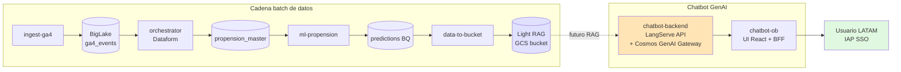
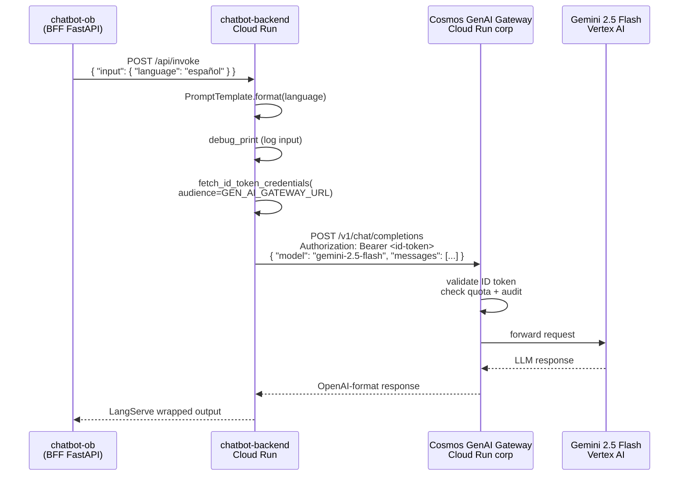
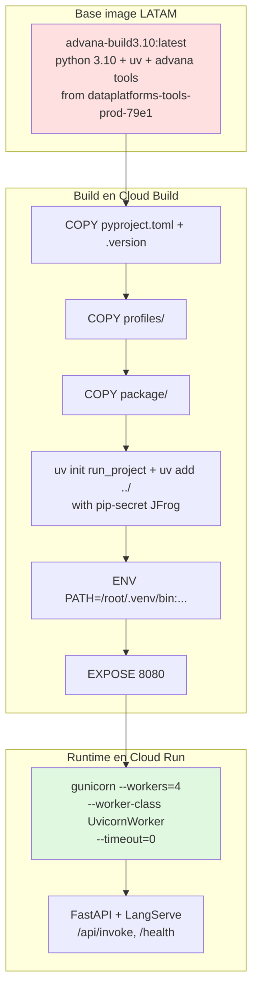

# 07 · chatbot-backend — Cloud Run API GenAI (LangServe + Gemini via Cosmos Gateway)

> Backend LLM que expone la lógica de chatbot como API HTTP. Cloud Run service que corre FastAPI + LangServe, y usa el **Cosmos GenAI Gateway** (proxy corporativo LATAM) para hablar con Gemini 2.5 Flash sin manejar API keys directamente. En el snapshot documentado el repo está como **scaffold puro del template genai-api-bundle v1.8.0** con la opción `use_simple_api: true` — sólo devuelve "Hola Mundo" en el idioma que le pases. Este playbook cubre qué trae el template y cómo extenderlo para el chatbot de propensión real.

## Índice

- [Contexto de negocio](#contexto-de-negocio)
- [Arquitectura del repo](#arquitectura-del-repo)
- [Diagramas](#diagramas)
- [Setup local (Dell LATAM)](#setup-local-dell-latam)
- [Flujo de trabajo](#flujo-de-trabajo)
- [Actividad real en `develop`](#actividad-real-en-develop)
- [Pitfalls vividos](#pitfalls-vividos)
- [Datos y ejecución operativa](#datos-y-ejecución-operativa)
- [Checklist de entrega](#checklist-de-entrega)
- [Referencias cruzadas](#referencias-cruzadas)

---

## Contexto de negocio

Este repo es el **cerebro LLM** del chatbot de propensión. Se ubica entre el UI ([06 · chatbot-ob](./06-chatbot-ob.md)) y los datos ya procesados por la cadena batch:

```
UI (chatbot-ob) ──► chatbot-backend (LangServe API) ──► Cosmos GenAI Gateway ──► Gemini 2.5 Flash
                          │
                          └──► [futuro] Light RAG datastore (data-to-bucket output)
```

**Por qué existe el Cosmos GenAI Gateway**:

LATAM no permite que cada servicio hable directo con Vertex AI o con OpenAI. Todos los llamados a LLMs pasan por el gateway corporativo (`cosmos-genai-gateway-*.us-east1.run.app`), que:
- Autentica al service caller vía **ID token IAM** (no API keys).
- Aplica quotas, rate limiting y auditoría por proyecto.
- Enruta al modelo seleccionado (Gemini, Claude, GPT-4) con la misma interfaz OpenAI-compatible.
- Registra el consumo por producto (`ss-data-dev` vs `ss-data-prod`).

El repo usa `langchain-openai` como cliente pero apunta `base_url` al gateway — el gateway se comporta como OpenAI-compatible endpoint.

**Snapshot actual (31-jul-2026)**: sólo scaffold Cosmos, 1 solo commit en `develop` (`[COSMOS] Initial commit`). El `application.yaml` tiene un prompt hardcoded que dice "Imprime 'Hola Mundo' en el idioma X" — placeholder del template. La lógica real de chatbot de propensión (RAG sobre el Light RAG datastore + prompts de contexto comercial) es el siguiente hito.

---

## Arquitectura del repo

```
nelsonacosta-ob-chatbot-backend/
├── nelsonacosta_ob_chatbot_backend/
│   ├── __main__.py           # FastAPI app + add_routes(LangServe) + /health + custom openapi
│   ├── chain.py              # generate_chain(): PromptTemplate | debug_print | ChatOpenAI
│   ├── schemas.py            # InputData Pydantic: language: str
│   ├── utils.py              # get_model(): ChatOpenAI apuntando al Cosmos GenAI Gateway
│   └── constants.py          # GEN_AI_GATEWAY_URL, LLM, MODEL, LANGUAGE, API_PROMPT
├── profiles/
│   ├── application.yaml      # llm.model=gemini-2.5-flash, temperature=0.1, api_prompt
│   ├── application-dev.yaml  # GEN_AI_GATEWAY_URL de dev (ss-data-dev)
│   └── application-prod.yaml # GEN_AI_GATEWAY_URL de prod (ss-data-prod)
├── tests/
│   └── test_base.py          # test /health únicamente
├── docs/
│   ├── dev.md                # guía dev
│   └── index.md              # docs usuarios
├── Dockerfile                # advana-build3.10 base, uv sync, gunicorn 4 workers
├── .gitlab-ci.yml            # include cloud-run-pipeline.yml
├── Makefile                  # venv/install/lint/test/security (Linux/Mac)
├── commands.ps1              # equivalente PowerShell del Makefile (Windows)
├── catalog-info.yaml         # Backstage: type=service, tags=[chatbot, llm, api]
├── openapi.json              # OpenAPI schema autogenerado en /health y /api/invoke
├── pyproject.toml            # fastapi, langchain, langserve, langchain-openai, cosmos-gcp
├── .copier-answers.yml       # config del template Copier (v1.8.0, use_simple_api=true)
└── .version                  # version bump manual
```

Piezas clave:

- **`chain.py`**: la "chain" es minimalista — `PromptTemplate | RunnableLambda(debug_print) | ChatOpenAI`. Cambiando el prompt en `application.yaml` cambiás el comportamiento sin tocar código.
- **`utils.py::get_model()`**: la parte no-trivial. Instancia `ChatOpenAI` pero apuntando `base_url` al Cosmos GenAI Gateway. La auth se hace refrescando un **ID token IAM** con `fetch_id_token_credentials(audience=gateway_url)` en cada llamado — no hay API keys que rotar, la SA del Cloud Run service se autoriza contra el gateway.
- **LangServe `add_routes(app, chain, path="/api")`**: expone automáticamente `/api/invoke`, `/api/batch`, `/api/stream`, `/api/playground` con el schema Pydantic de `InputData`.
- **Gunicorn 4 workers**: en el Dockerfile arranca con `--workers=4 --timeout=0 --worker-class=uvicorn.workers.UvicornWorker`. Timeout 0 porque los llamados a LLM pueden tardar >30s.

**Opciones del template Copier que NO están activadas** (mirar `.copier-answers.yml`):
- `use_langchain: false` → no hay agents complejos, sólo un runnable simple.
- `use_lightrag_datastore: false` → no está conectado al Light RAG todavía.
- `use_agent: false` → no hay tool calling.
- `use_cloudsql_sessions: false` → no hay memoria de conversación persistente.
- `use_openai: false` → usa Gemini via el gateway.
- `use_adk: false` → no usa Google Agent Development Kit.

Activar cualquiera de esas flags requiere regenerar el scaffold con `copier` — o portar los módulos manualmente.

---

## Diagramas

### Diagrama 1: Cadena end-to-end completa (los 7 repos)



### Diagrama 2: Runtime de una request `/api/invoke`



### Diagrama 3: Docker multi-stage (advana base image)



---

## Setup local (Dell LATAM)

```powershell
# 1. Clonar
git clone https://gitlab.com/latamairlines/data/shared-services/cross/nelsonacosta-ob/nelsonacosta-ob-chatbot-backend.git
cd nelsonacosta-ob-chatbot-backend
git checkout develop

# 2. Auth GCP (necesario porque el service usa ADC para obtener ID token del gateway)
gcloud auth application-default login
gcloud config set project ss-data-dev

# 3. Auth JFrog / pip config (para deps privadas LATAM)
# El pip config de Dell debe tener la extra-index-url del Artifactory LATAM
pip config get global.extra-index-url

# 4. Setup venv con uv
uv venv .venv
.venv\Scripts\activate

# 5. Install
uv sync --extra dev --extra test
# equivalente PowerShell del Makefile: .\commands.ps1 install
```

Correr local:

```powershell
# Setear el env que apunta al gateway de dev
$env:APP_ENVIRONMENT = "dev"

# Arrancar el server
uv run uvicorn nelsonacosta_ob_chatbot_backend.__main__:app --reload --port 8080

# Verificar /health
curl http://localhost:8080/health
# → { "status": "ok", "version": "0.1.0" }

# Probar el /api/invoke (chain "Hola Mundo")
curl -X POST http://localhost:8080/api/invoke `
  -H "Content-Type: application/json" `
  -d '{ \"input\": { \"language\": \"español\" } }'
```

**Playground interactivo**: LangServe expone `http://localhost:8080/api/playground` — UI web donde probar la chain con inputs Pydantic tipados. Útil para debug rápido antes de tocar el UI.

**Swagger UI**: `http://localhost:8080/docs` — OpenAPI autogenerado.

---

## Flujo de trabajo

1. **Branch desde `develop`**

   ```powershell
   git checkout develop
   git pull --rebase
   git checkout -b feature/mi-cambio
   ```

2. **Puntos de extensión típicos**:
   - **Cambiar el prompt**: editar `profiles/application.yaml` clave `api_prompt`. No hace falta tocar código.
   - **Cambiar el modelo**: editar `llm.model` en `application.yaml` (opciones que expone el gateway: `gemini-2.5-flash`, `gemini-2.5-pro`, `claude-3-5-sonnet-v2@20241022`, etc. — confirmar con el equipo Cosmos qué modelos están habilitados en el gateway corporativo).
   - **Añadir input fields al chain**: extender `schemas.py::InputData` con campos nuevos, y referenciarlos como `{campo}` en el prompt.
   - **Agregar RAG desde Light RAG**: portar el módulo `use_lightrag_datastore` del template (o escribir un `RunnablePassthrough.assign(context=retrieve_from_gcs)` que lea del bucket de [04 · data-to-bucket](./04-data-to-bucket.md)).
   - **Agregar memoria de conversación**: activar `use_cloudsql_sessions` regenerando el scaffold, o portar el módulo a mano — requiere una instancia Cloud SQL Postgres.

3. **Lint local**

   ```powershell
   .\commands.ps1 lint
   # equivale a: uv run ruff check --exit-zero --output-format concise .
   ```

4. **Tests**

   ```powershell
   .\commands.ps1 test
   # Cobertura mínima: 65% (configurada en Makefile --cov-fail-under 65)
   # El test_base.py sólo cubre /health — cuando agregues lógica de chain, escribir tests con mocks del gateway
   ```

5. **Security scan**

   ```powershell
   .\commands.ps1 security
   # Corre safety check sobre requirements exportados de uv.lock
   ```

6. **Docker build local** (opcional, útil para debug de la imagen)

   ```powershell
   docker build `
     --secret id=pip-secret,src=$env:USERPROFILE/.pip/pip.conf `
     -t chatbot-backend:local .

   docker run -p 8080:8080 `
     -v $env:USERPROFILE/.config/gcloud:/root/.config/gcloud `
     -e APP_ENVIRONMENT=dev `
     chatbot-backend:local
   ```

7. **Commit + push + MR** contra `develop`. Reviewer `<REVIEWER_NEURALWORKS>` aprueba; merge por UI.

8. **CI verde** → deploy Cloud Run en `ss-data-dev`.

9. **Verificación post-deploy**:

   ```powershell
   $url = gcloud run services describe nelsonacosta-ob-chatbot-backend `
     --region us-east1 --project ss-data-dev --format "value(status.url)"

   # Health check con ID token (el service NO tiene IAP, la auth es service-to-service)
   $token = gcloud auth print-identity-token
   curl -H "Authorization: Bearer $token" "$url/health"
   ```

---

## Actividad real en `develop`

| Métrica              | Valor                                    |
|----------------------|------------------------------------------|
| Rango de fechas      | 2026-07-23 → 2026-07-23                  |
| Commits totales      | 1 (scaffold Cosmos inicial)              |
| Merge Requests       | 0                                        |
| Archivos tocados     | 31 (todos del scaffold, ninguno modificado post-init) |
| Cobertura test       | ~100% del `/health` — `<1%` del código real (`chain.py` sin tests) |
| LOC efectivas propias| 0 (todo scaffold)                        |

Historial condensado:

| Fecha       | Commit    | MR   | Foco                                    |
|-------------|-----------|------|-----------------------------------------|
| 23-jul-2026 | `df811f4` | —    | `[COSMOS] Initial commit` — scaffold genai-api-bundle v1.8.0 (use_simple_api=true) |

**Nota**: igual que [06 · chatbot-ob](./06-chatbot-ob.md), este repo se dejó como scaffold porque la cadena de datos (01-05) era la prioridad del hands-on. La lógica de chatbot de propensión (RAG + prompts comerciales) es el siguiente hito.

---

## Pitfalls vividos

### Pitfall X1 — `fetch_id_token_credentials` requiere ADC configurado localmente (23-jul-2026)

**Síntoma** (esperado al primer `curl` local): `google.auth.exceptions.DefaultCredentialsError: Could not automatically determine credentials`.

**Causa**: `get_model()` llama `fetch_id_token_credentials(audience=GEN_AI_GATEWAY_URL)` que necesita ADC (Application Default Credentials) para firmar el ID token. En Cloud Run se resuelve solo (la SA del service tiene identidad IAM); en local hay que setearlo.

**Solución**:

```powershell
gcloud auth application-default login
# Confirmar:
gcloud auth application-default print-access-token
```

**Regla**: siempre correr `gcloud auth application-default login` antes del primer `uvicorn` local. Si el token venció, refrescar con el mismo comando.

---

### Pitfall X2 — El gateway URL cambia por proyecto (número de proyecto en la URL) (23-jul-2026)

**Síntoma**: en `application-dev.yaml` el gateway es `cosmos-genai-gateway-312309281244.us-east1.run.app`; en `application-prod.yaml` es `cosmos-genai-gateway-377168389360.us-east1.run.app`. Fácil pegar el número equivocado y todos los llamados fallan con 403.

**Causa**: el gateway está desplegado en dos proyectos corporativos separados (uno para `ss-data-dev`, otro para `ss-data-prod`). El número al final de la URL es el **project number** del proyecto donde está el gateway (no del que llama).

**Solución**: nunca hardcodear el gateway URL en código. Siempre venir de `properties[GEN_AI_GATEWAY_URL]`, que se lee del `application-<env>.yaml` correspondiente. Confirmar el URL correcto con el equipo Cosmos si aparece 403.

**Regla**: en un MR de deploy nuevo, revisar visualmente que `application-dev.yaml` y `application-prod.yaml` tengan URLs distintas y coincidan con los defaults del `.copier-answers.yml`.

---

### Pitfall X3 — Prompt hardcoded en `application.yaml` sobrevive al deploy (23-jul-2026)

**Síntoma**: se hace deploy a dev, y `/api/invoke` sigue devolviendo "Hola Mundo!" en vez de la respuesta de propensión esperada.

**Causa**: el template deja el prompt de ejemplo en `profiles/application.yaml`:

```yaml
api_prompt: |-
  """
  Imprime la frase 'Hola Mundo!' en el siguiente idioma: {language}
  """
```

Si nadie lo edita, el chatbot deployado sigue diciendo Hola Mundo. Es fácil olvidarlo porque el archivo se llama "application" y parece config, no lógica.

**Solución**: en el primer MR de negocio, reemplazar el `api_prompt` con el prompt real del chatbot de propensión, y probablemente extender `InputData` con más campos que el prompt use (customer_id, historial, etc.).

**Regla**: agregar al checklist de entrega: "verificar que `api_prompt` no dice 'Hola Mundo'". Ver también `constants.py::API_PROMPT` para el key correcto.

---

### Pitfall X4 — Docker build base image requiere acceso al registry `dataplatforms-tools-prod-79e1` (23-jul-2026)

**Síntoma**: `docker build` local falla con `unauthorized: authentication required` al hacer `FROM us-east1-docker.pkg.dev/dataplatforms-tools-prod-79e1/dbi/advana-build3.10:latest`.

**Causa**: la base image `advana-build3.10` es privada de LATAM (proyecto `dataplatforms-tools-prod-79e1`). Sin auth a Artifact Registry, docker no la puede pullear.

**Solución**:

```powershell
gcloud auth configure-docker us-east1-docker.pkg.dev
# Ahora docker puede pullear del registry corp
docker pull us-east1-docker.pkg.dev/dataplatforms-tools-prod-79e1/dbi/advana-build3.10:latest
```

**Regla**: cada vez que se cambie de Dell o se reinstale docker, correr `gcloud auth configure-docker` antes del primer build. En Cloud Build (CI) esto está pre-configurado.

---

### Pitfall X5 — `gunicorn --timeout=0` es intencional y no se debe "arreglar" (23-jul-2026)

**Síntoma**: reviewer nuevo ve `--timeout=0` en el Dockerfile y sugiere "esto es un bug, poner un timeout razonable".

**Causa**: los llamados a LLM (especialmente Gemini Pro con contextos largos) pueden tardar 60-120 segundos. Un timeout gunicorn menor mataría requests legítimos a mitad de camino.

**Solución**: **NO tocar** `--timeout=0`. El control de timeout se hace en dos capas superiores:
1. Cloud Run `--timeout` del service (default 60m, se puede bajar en el pipeline si hace falta).
2. El cliente HTTP del chatbot-ob (BFF) con un timeout razonable a nivel request.

**Regla**: si aparece este comentario en un MR, responder linkeando este pitfall. El `timeout=0` es el patrón oficial de Cosmos para servicios GenAI.

---

## Datos y ejecución operativa

### Artefactos SQL / Schema

**No aplica directamente**. Este repo no tiene tablas propias.

Referencias cruzadas cuando se conecte el RAG:
- Predictions que el chatbot va a consultar: ver [Playbook 03 · ml-propension](./03-ml-propension.md).
- Light RAG payloads que se cargarán como contexto: ver [Playbook 04 · data-to-bucket](./04-data-to-bucket.md).

**OpenAPI schema del scaffold**: `assets/genai/chatbot-backend/openapi.json` (copia sanitizada del generado automáticamente).

**Application.yaml de ejemplo**: `assets/genai/chatbot-backend/application.yaml.example` (con el prompt "Hola Mundo" placeholder — reemplazar con el prompt real en el primer MR de negocio).

### Comandos operativos Dell (PowerShell)

**Ver logs en tiempo real:**

```powershell
gcloud logging tail 'resource.type=cloud_run_revision AND resource.labels.service_name=nelsonacosta-ob-chatbot-backend' `
  --project ss-data-dev
```

**Estado del service:**

```powershell
gcloud run services describe nelsonacosta-ob-chatbot-backend `
  --region us-east1 --project ss-data-dev `
  --format "value(status.url,status.conditions[0].type,status.latestReadyRevisionName)"
```

**Autorizar al chatbot-ob a llamar al chatbot-backend** (service-to-service):

```powershell
# La SA del chatbot-ob necesita rol run.invoker sobre este service
$obSA = "nelsonacosta-ob-chatbot-ob-sa@ss-data-dev.iam.gserviceaccount.com"

gcloud run services add-iam-policy-binding nelsonacosta-ob-chatbot-backend `
  --region us-east1 `
  --project ss-data-dev `
  --member "serviceAccount:$obSA" `
  --role "roles/run.invoker"
```

**Probar `/api/invoke` desde línea de comandos:**

```powershell
$url = gcloud run services describe nelsonacosta-ob-chatbot-backend --region us-east1 --project ss-data-dev --format "value(status.url)"
$token = gcloud auth print-identity-token

$body = @{ input = @{ language = "español" } } | ConvertTo-Json -Compress

Invoke-RestMethod -Uri "$url/api/invoke" `
  -Method Post `
  -Headers @{ Authorization = "Bearer $token"; "Content-Type" = "application/json" } `
  -Body $body
```

**Verificar quota consumida en el Cosmos GenAI Gateway** (si el equipo Cosmos expone un endpoint de metrics):

```powershell
# Consultar con equipo Cosmos el dashboard de gateway usage; no hay CLI pública de esto.
```

### Queries de verificación

**No aplica** — no hay BigQuery propio.

Verificación de negocio end-to-end (una vez conectado al UI y al RAG):
1. Abrir chatbot-ob en el browser corp.
2. Hacer una pregunta de propensión ("¿qué segmentos convierten mejor esta semana?").
3. Confirmar que la respuesta usa datos reales del Light RAG (no alucinaciones).
4. Cruzar contra las predictions en BQ: ver [Playbook 03 · ml-propension](./03-ml-propension.md) queries de verificación.

### Rollback / re-ejecución

**Rollback a revisión previa:**

```powershell
gcloud run revisions list --service nelsonacosta-ob-chatbot-backend --region us-east1 --project ss-data-dev --limit 10

gcloud run services update-traffic nelsonacosta-ob-chatbot-backend `
  --to-revisions <REVISION_NAME>=100 `
  --region us-east1 --project ss-data-dev
```

**Rebuild + redeploy manual** (si el CI está caído):

```powershell
# Build
docker build `
  --secret id=pip-secret,src=$env:USERPROFILE/.pip/pip.conf `
  -t us-east1-docker.pkg.dev/ss-data-dev/nelsonacosta-ob/chatbot-backend:manual .

# Push
docker push us-east1-docker.pkg.dev/ss-data-dev/nelsonacosta-ob/chatbot-backend:manual

# Deploy
gcloud run deploy nelsonacosta-ob-chatbot-backend `
  --image us-east1-docker.pkg.dev/ss-data-dev/nelsonacosta-ob/chatbot-backend:manual `
  --region us-east1 --project ss-data-dev
```

**Regenerar scaffold desde el template Copier** (si hay que activar `use_lightrag_datastore` etc):

```powershell
# En una carpeta temporal, correr copier para regenerar y comparar
pip install copier
copier copy git@gitlab.com:latamairlines/data/data-ai-ops/cosmos/cosmos-template/cosmos-template-genai-api-bundle.git chatbot-backend-regen
# Editar respuestas: use_lightrag_datastore=true, etc.
# Luego portar manualmente los diffs relevantes al repo real (no reemplazar el repo entero).
```

---

## Checklist de entrega

- [ ] ADC configurado (`gcloud auth application-default login`)
- [ ] `gcloud auth configure-docker us-east1-docker.pkg.dev` corrido al menos una vez
- [ ] Branch `feature/*` desde `develop` actualizado
- [ ] `application.yaml` con prompt real (NO "Hola Mundo")
- [ ] `application-dev.yaml` con `GEN_AI_GATEWAY_URL` de dev correcto
- [ ] `application-prod.yaml` con `GEN_AI_GATEWAY_URL` de prod correcto
- [ ] `schemas.py::InputData` con los campos que el prompt real necesita
- [ ] `uv run ruff check .` sin errores
- [ ] `uv run pytest` sin errores, cobertura ≥ 65%
- [ ] `curl /health` local → `{"status":"ok"}`
- [ ] `curl /api/invoke` local → respuesta LLM real (no error de auth)
- [ ] Docker build local exitoso
- [ ] Commit + push + MR contra `develop`
- [ ] Reviewer `<REVIEWER_NEURALWORKS>` aprobó
- [ ] Merge por UI (no vía API)
- [ ] CI verde
- [ ] Cloud Run service desplegado
- [ ] SA del `chatbot-ob` con `roles/run.invoker` sobre este service
- [ ] `curl` con ID token al `/api/invoke` de dev responde correctamente
- [ ] Logs limpios (sin traces de error) en los primeros 10 requests

---

## Referencias cruzadas

- [00-README](../00-README.md) · índice del playbook
- [01-glossary](../01-glossary.md) · LangServe, Cosmos GenAI Gateway, ID token IAM, Gemini
- [02-prerequisitos-globales](../02-prerequisitos-globales.md) · UV, docker, gcloud, PowerShell
- [Playbook 03 · ml-propension](./03-ml-propension.md) · genera las predictions BQ que van al Light RAG
- [Playbook 04 · data-to-bucket](./04-data-to-bucket.md) · exporta al Light RAG que este backend consumirá
- [Playbook 06 · chatbot-ob](./06-chatbot-ob.md) · UI que consume esta API

**Assets locales:**
- `assets/genai/chatbot-backend/application.yaml.example` · profile de ejemplo (con placeholder Hola Mundo)
- `assets/genai/chatbot-backend/openapi.json` · OpenAPI schema autogenerado del scaffold

**Fuente autoritativa GitLab (rama `develop`):**
`https://gitlab.com/latamairlines/data/shared-services/cross/nelsonacosta-ob/nelsonacosta-ob-chatbot-backend/-/tree/develop`

**Template Copier upstream:**
`git@gitlab.com:latamairlines/data/data-ai-ops/cosmos/cosmos-template/cosmos-template-genai-api-bundle.git` (versión usada: `v1.8.0`)
